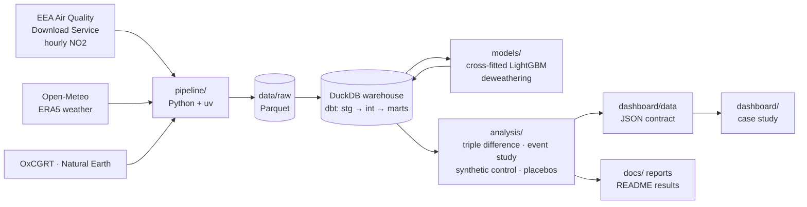

# The €9 Experiment
### Did nearly-free public transport clean Germany's air?

In summer 2022 Germany sold a **€9-a-month ticket valid on all local and regional public transport**.
<!-- TODO(source): ticket sales figure (VDV) — add only with a linked source. -->
Three months later it was gone, and in May 2023 the **€49 Deutschlandticket** replaced it permanently.
Two policy switches, on, off and on again, make a natural experiment for 80 million people.

This project measures whether those switches changed **urban NO₂**, the pollutant most tied to road
traffic, using hourly data from monitoring stations in Germany and seven neighbouring countries.

<!-- TODO(summary): one honest paragraph summarising the result — written by the author after the
FINAL run, from the Results table below. Not before. -->

---

## The question
1. Did the 9-Euro-Ticket reduce NO₂ at German urban stations, relative to what weather and season
   predict and relative to comparable stations abroad?
2. Did the effect switch **off** when the ticket ended (Sept 2022) and back **on** with the
   Deutschlandticket (May 2023)?
3. How much of a 2022 change could come from the simultaneous fuel tax cut ("Tankrabatt"), post-COVID
   recovery or the energy crisis instead?

**Prior work.** The question has been studied before (e.g. Gohl & Schrauth 2024, *Journal of Urban
Economics*; Aydin & Kürschner Rauck 2023). This project is an independent, transparent
replication-and-extension: cross-country controls, explicit deweathering, both ticket episodes, a
pre-registered analysis plan, and every step reproducible from public data.

## Method
1. **Data engineering.** Hourly verified NO₂ (EEA E1a, 2018–2025) for 887 urban/suburban stations in
   DE, AT, BE, CH, CZ, FR, NL and PL, and hourly ERA5 weather (Open-Meteo, 1.0° grid). Everything
   goes into a DuckDB warehouse built with dbt (staging → intermediate → marts, with tests).
2. **Deweathering.** One LightGBM model per station learns NO₂ from weather and calendar features
   on pre-treatment data only (2018–19, Jan–May 2022). Pre-treatment predictions are
   **cross-fitted** (month blocks, 5 folds, 7-day buffer), so pre- and post-treatment residuals are
   both out-of-sample (ADR-006, ADR-007). Outcome: `ratio_pct` = observed / predicted − 1, per
   station-day.
3. **Causal inference, pre-registered** (ADR-008, committed before any estimate). The primary
   estimate is a triple difference: Germany minus controls, Jun–Aug vs Jan–May 2022, minus the
   same contrast in 2018–19. Alongside it: an event study, a country-level synthetic control,
   placebo dates and placebo countries, and two-way clustered CIs. An effect counts as "detected"
   only if its CI excludes 0 **and** it lies outside the placebo-country range.
4. **Confounders.** The Tankrabatt, COVID measures (OxCGRT), fuel discounts in control countries
   and the energy crisis are handled explicitly or flagged. Post-hoc diagnostics are separated
   from the pre-registered verdict (ADR-009, ADR-010).

## Architecture


## Results
<!-- RESULTS:START -->
> **PROVISIONAL — do not cite.** Only 191 of 587 control stations have deweathered predictions so far (weather download incomplete). Every number below will change in the final run.

| Estimate | Outcome | Estimate [95 % CI] | Placebo-country range | Verdict | Stations DE / controls |
|---|---|---|---|---|---|
| 9-Euro-Ticket (Jun–Aug 2022) | ratio_pct (% pts) | +5.50 [+2.88, +8.13] | [-6.19, +5.12] | detected (higher NO₂) | 284 / 173 |
| 9-Euro-Ticket, µg/m³ | resid_ugm3 (µg/m³) | +0.00 [-0.76, +0.76] | [-1.99, +2.16] | not detected | 284 / 173 |
| Switch-off (Sep–Dec 2022) | ratio_pct (% pts) | +6.73 [+4.01, +9.45] | [-9.05, +7.64] | not detected | 284 / 173 |
| Switch-off, controls AT+CH | ratio_pct (% pts) | +9.61 [+4.60, +14.62] | – | not evaluated | 284 / 56 |
| Deutschlandticket (May–Dec 2023) | ratio_pct (% pts) | -0.08 [-2.28, +2.11] | [-4.93, +2.57] | not detected | 284 / 173 |
| Deutschlandticket, µg/m³ | resid_ugm3 (µg/m³) | -0.72 [-1.40, -0.05] | [-1.50, +0.89] | not detected | 284 / 173 |
| Persistence 2024 | ratio_pct (% pts) | -1.40 [-3.02, +0.23] | – | not evaluated | 284 / 173 |
| Persistence 2024, country trends | ratio_pct (% pts) | +1.33 [-0.27, +2.94] | – | not evaluated | 284 / 173 |
| Persistence 2025 | ratio_pct (% pts) | +1.62 [-0.04, +3.27] | – | not evaluated | 284 / 173 |
| Persistence 2025, country trends | ratio_pct (% pts) | +6.34 [+4.64, +8.04] | – | not evaluated | 284 / 173 |
| Classic two-way FE DiD (biased) | ratio_pct (% pts) | -2.50 [-4.79, -0.22] | – | not evaluated | 284 / 173 |
| Traffic stations | ratio_pct (% pts) | +1.53 [-1.29, +4.36] | – | not evaluated | 113 / 54 |
| Background stations | ratio_pct (% pts) | +7.30 [+4.17, +10.43] | – | not evaluated | 171 / 119 |
| Weekdays | ratio_pct (% pts) | +4.78 [+2.07, +7.50] | – | not evaluated | 284 / 173 |
| Weekends | ratio_pct (% pts) | +7.29 [+3.48, +11.09] | – | not evaluated | 284 / 173 |
| Commute excess, traffic (weekdays) | commute_excess (% pts) | -1.66 [-6.06, +2.74] | [-5.00, +5.63] | not evaluated | 113 / 54 |

ratio_pct: observed / deweathered prediction − 1, in percentage points; negative = less NO₂ than expected. Verdict = ADR-008 rule (CI excludes 0 and outside the placebo-country range); the headline is the ratio_pct verdict, the µg/m³ verdicts are a secondary outcome (ADR-010); "not evaluated" = outside the rule. Full tables: [`docs/results_provisional.md`](docs/results_provisional.md) / `docs/results.md`, [`docs/diagnostics_provisional.md`](docs/diagnostics_provisional.md).

_Generated from `dashboard/data/headline.json` (2026-10-06T03:04:39Z) by `analysis/readme_results.py`._
<!-- RESULTS:END -->

## How to run
```bash
git clone https://github.com/Sbaiii/ticket-to-breathe.git
cd ticket-to-breathe
uv sync                                       # Python 3.12 + dependencies
brew install libomp                           # macOS only: OpenMP runtime for LightGBM

# 1) Downloads (long-running, idempotent, resumable)
uv run python -m pipeline.eea_download        # EEA E1a NO2, hourly Parquet
uv run python -m pipeline.eea_metadata        # station metadata
uv run python -m pipeline.station_funnel      # study set (ADR-002)
uv run python -m pipeline.weather_locations   # 1.0° weather grid (ADR-005)
uv run python -m pipeline.weather_download    # Open-Meteo ERA5, throttled (~3 days); --status

# 2) Everything downstream, in one command
make all
```
`make all` runs, in order:
1. weather check (stops with an error if the weather download is incomplete);
2. seeds, OxCGRT and boundary downloads, then `dbt build`;
3. deweathering (`models/deweather.py`, up-to-date stations skipped);
4. `dbt build` of the residual marts;
5. analysis (ADR-008 estimates + ADR-009 diagnostics + figures);
6. dashboard data;
7. README results;
8. reports.

It ends with a checklist. Single steps: `make check-weather`, `make warehouse`, `make deweather`,
`make marts`, `make analysis`, `make dashboard`, `make readme`, `make reports`.

| Folder | What's inside |
|---|---|
| `pipeline/` | download scripts (EEA, Open-Meteo, OxCGRT, Natural Earth), seeds, checks |
| `warehouse/` | dbt project on DuckDB (models, seeds, tests) |
| `models/` | cross-fitted LightGBM deweathering + its report |
| `analysis/` | causal estimators, diagnostics, figures, reports, dashboard data, read-only notebook |
| `dashboard/` | the case study; `dashboard/data/` = JSON data contract (see `dashboard/README.md`) |
| `docs/` | reports, figures, data sources & licences |
| `lab-notebook/` | Obsidian research notebook: brief, roadmap, decisions (ADRs), daily log, findings |

## Data & licences
- Air quality: © European Environment Agency (EEA), Air Quality download service, reused under
  [CC BY 4.0](https://creativecommons.org/licenses/by/4.0/). Verified (E1a) data.
- Weather: [Open-Meteo.com](https://open-meteo.com/) (ERA5 reanalysis, Copernicus Climate Change
  Service), [CC BY 4.0](https://creativecommons.org/licenses/by/4.0/).
- COVID policy stringency: Oxford COVID-19 Government Response Tracker (Hale et al. 2021,
  https://doi.org/10.1038/s41562-021-01079-8), [CC BY 4.0](https://creativecommons.org/licenses/by/4.0/).
- Country boundaries: [Natural Earth](https://www.naturalearthdata.com/), public domain. Made with
  Natural Earth.
- Details and access notes: [`docs/data_sources.md`](docs/data_sources.md).

---
Built by **Abdellah Sbai** · [sbaiii.com](https://sbaiii.com)
