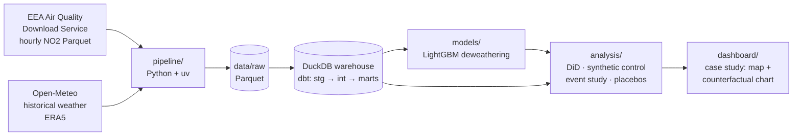

# The €9 Experiment
### Did nearly-free public transport clean Germany's air?

In summer 2022 Germany sold a **€9-a-month ticket valid on all local and regional public transport**.
About 52 million were sold (VDV figure — source to be linked in `docs/`). Three months later it was gone — and in May 2023 the **€49 Deutschlandticket**
replaced it permanently. Two policy switches, on, off, on again: a natural experiment for 80 million people.

This project measures whether those switches changed **urban NO₂**, the pollutant most tied to road traffic,
using hourly data from monitoring stations across Germany and neighbouring countries.

> **Status:** 🚧 in progress — no results yet. Nothing below the line "Results" is filled in until the
> analysis code produces it.

---

## The question
1. Did the 9-Euro-Ticket reduce NO₂ at German urban stations, relative to what weather and seasonality predict
   and relative to comparable stations abroad?
2. Did the effect switch **off** when the ticket ended (Sept 2022) and back **on** with the Deutschlandticket (May 2023)?
3. How much of the 2022 effect could be the simultaneous fuel tax cut ("Tankrabatt"), post-COVID recovery or
   the energy crisis instead?

## Method (short)
1. **Data engineering** — hourly NO₂ for ~2018–2025 from the EEA Air Quality Download Service (Germany + control
   countries), station metadata, and hourly reanalysis weather (Open-Meteo / ERA5), into a DuckDB warehouse.
2. **Deweathering** — a LightGBM model learns NO₂ from weather and calendar features on pre-policy data;
   the residual is "pollution not explained by weather".
3. **Causal inference** — difference-in-differences, synthetic control and an event study; placebo dates,
   placebo countries, and confidence intervals clustered at station level.
4. **Confounders** — handled one by one, or openly flagged where the data can't separate them.

## Architecture


## Results
_Placeholder — to be written from the analysis outputs. No numbers until the code produces them._

## Prior work
This question has been studied before (e.g. Gohl & Schrauth 2024, *Journal of Urban Economics*; Aydin &
Kürschner Rauck 2023). This project is an independent, transparent replication-and-extension: cross-country
controls, explicit deweathering, both ticket episodes, and every step reproducible from public data.

## How to run
```bash
git clone https://github.com/Sbaiii/ticket-to-breathe.git
cd ticket-to-breathe
uv sync                                       # Python 3.12 + dependencies
brew install libomp                           # macOS only: OpenMP runtime for LightGBM

# 1) Downloads (long-running, idempotent, resumable)
uv run python -m pipeline.eea_download        # EEA E1a NO2, hourly Parquet
uv run python -m pipeline.eea_metadata        # station metadata
uv run python -m pipeline.station_funnel      # study set (ADR-002)
uv run python -m pipeline.weather_locations   # 1.0° weather grid (ADR-005)
uv run python -m pipeline.weather_download    # Open-Meteo ERA5, throttled (~3 days); --status

# 2) Everything downstream, in one command (re-run any time, e.g. after the weather download)
make all   # seeds → dbt build → deweathering → residual marts → report → causal analysis
```
`make all` runs `pipeline/build_seeds.py`, `dbt build` (all models except the deweathering marts),
`models/deweather.py` (cross-fitted LightGBM per station, ADR-007; up-to-date stations are skipped),
`dbt build` of `fct_station_hour_deweathered` / `fct_station_day_resid` with their tests, and
`models/deweather_report.py` → `docs/deweathering_report.md`, and the ADR-008 analysis
(`analysis/causal.py`, `figures.py`, `report.py`, notebook). Single steps: `make seeds`,
`make warehouse`, `make deweather`, `make marts`, `make report`, `make analysis`.

## Repo map
| Folder | What's inside |
|---|---|
| `pipeline/` | download scripts (EEA, Open-Meteo) |
| `warehouse/` | DuckDB + dbt models |
| `models/` | LightGBM deweathering |
| `analysis/` | notebooks: EDA, DiD, synthetic control, event study |
| `dashboard/` | the scrollable case study |
| `docs/` | methods appendix, data sources & licences |
| `lab-notebook/` | Obsidian research notebook: brief, roadmap, decisions, daily log, findings |

## Data & licences
- Air quality: © European Environment Agency (EEA), Air Quality download service, reused under
  [CC BY 4.0](https://creativecommons.org/licenses/by/4.0/). Verified (E1a) and up-to-date unverified (E2a) data.
- Weather: [Open-Meteo.com](https://open-meteo.com/) (ERA5 reanalysis, Copernicus Climate Change Service),
  [CC BY 4.0](https://creativecommons.org/licenses/by/4.0/).

---
Built by **Abdellah Sbai** · [sbaiii.com](https://sbaiii.com)
