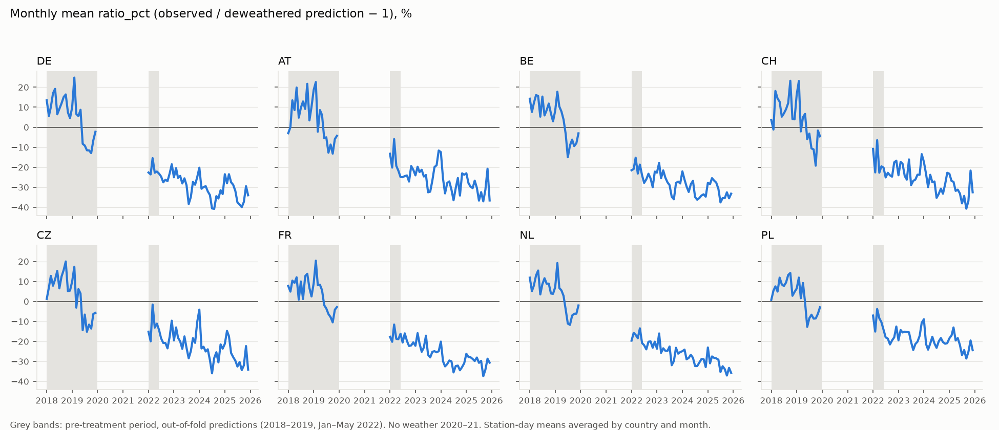
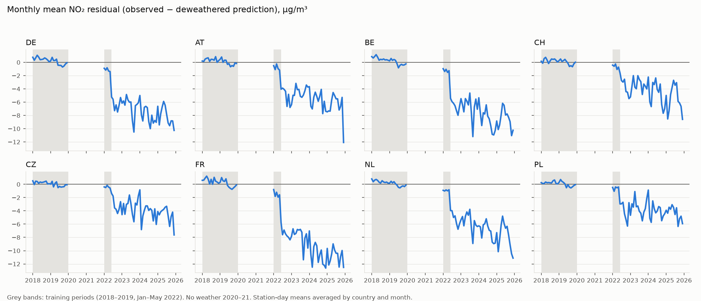

# Deweathering report (v2: cross-fitted, ratio outcome)

Generated by `models/deweather_report.py` on 2026-10-06 10:04 UTC from `data/warehouse.duckdb` (model spec `dc70284e2372`, ADR-006 + ADR-007). Pre-treatment predictions are out-of-fold (5 folds of whole calendar months, round-robin, 7-day buffer); post-treatment predictions are the mean of the fold models. Primary outcome: `ratio_pct` = 100 × (Σ observed / Σ predicted − 1) per station-day; secondary: `resid_ugm3` = mean observed − mean predicted. Facts first; short interpretation at the end. No policy effect is computed here.

## 0) Coverage

| country_code | study_stations | with_predictions | skipped |
|---|---|---|---|
| DE | 300 | 300 | 0 |
| AT | 95 | 95 | 0 |
| BE | 33 | 33 | 0 |
| CH | 22 | 22 | 0 |
| CZ | 46 | 46 | 0 |
| FR | 266 | 266 | 0 |
| NL | 46 | 46 | 0 |
| PL | 79 | 79 | 0 |

Skip reasons: none.

Station-days in `fct_station_day_resid`: 1,874,775; ratio guard (Σ predicted ≤ 0 → ratio_pct null): 22.

## a) Validation per station — median [IQR] by country and type

RMSE and bias in µg/m³; bias = mean(predicted − observed) over hours. Daily = means over local days with ≥ 18 hours. corr² = squared Pearson correlation of daily means (ignores level errors, unlike R²).

**Out-of-fold (OOF), main model — every pre-treatment hour predicted by a fold model that never saw its month ± 7 days**

| country | type | stations | hourly R² | daily R² | daily corr² | hourly RMSE | daily RMSE | bias |
|---|---|---|---|---|---|---|---|---|
| DE | background | 171 | 0.61 [0.57, 0.64] | 0.70 [0.65, 0.74] | 0.70 [0.66, 0.74] | 7.81 [6.49, 9.43] | 4.70 [3.86, 5.65] | -0.05 [-0.09, 0.03] |
| DE | industrial | 16 | 0.60 [0.56, 0.63] | 0.71 [0.69, 0.76] | 0.71 [0.70, 0.76] | 8.21 [5.96, 10.02] | 4.82 [3.53, 5.60] | -0.05 [-0.10, 0.02] |
| DE | traffic | 113 | 0.60 [0.55, 0.64] | 0.63 [0.53, 0.69] | 0.63 [0.53, 0.69] | 11.70 [9.81, 13.45] | 7.60 [6.43, 8.95] | -0.07 [-0.18, 0.03] |
| AT | background | 63 | 0.58 [0.55, 0.63] | 0.68 [0.63, 0.73] | 0.69 [0.64, 0.73] | 8.39 [7.35, 9.84] | 5.29 [4.37, 6.02] | 0.05 [-0.04, 0.14] |
| AT | industrial | 4 | 0.53 [0.53, 0.54] | 0.67 [0.61, 0.72] | 0.67 [0.62, 0.72] | 8.47 [7.37, 9.98] | 4.81 [4.10, 5.73] | -0.10 [-0.16, -0.01] |
| AT | traffic | 28 | 0.55 [0.51, 0.61] | 0.58 [0.51, 0.65] | 0.58 [0.52, 0.66] | 11.44 [10.58, 12.65] | 7.24 [6.37, 8.55] | 0.01 [-0.11, 0.11] |
| BE | background | 19 | 0.67 [0.65, 0.68] | 0.76 [0.71, 0.79] | 0.76 [0.72, 0.79] | 9.47 [8.59, 10.35] | 5.77 [5.07, 6.39] | -0.02 [-0.07, 0.05] |
| BE | industrial | 10 | 0.66 [0.64, 0.69] | 0.76 [0.72, 0.79] | 0.76 [0.72, 0.79] | 8.64 [8.08, 10.70] | 4.97 [4.66, 6.09] | -0.05 [-0.10, 0.01] |
| BE | traffic | 4 | 0.65 [0.61, 0.65] | 0.71 [0.63, 0.71] | 0.71 [0.64, 0.71] | 11.93 [11.54, 13.12] | 7.81 [7.56, 8.89] | -0.06 [-0.14, 0.01] |
| CH | background | 13 | 0.61 [0.51, 0.65] | 0.74 [0.59, 0.75] | 0.74 [0.59, 0.76] | 8.52 [8.19, 9.77] | 5.35 [4.87, 6.36] | -0.13 [-0.16, 0.01] |
| CH | traffic | 9 | 0.45 [0.44, 0.59] | 0.49 [0.37, 0.53] | 0.50 [0.39, 0.54] | 13.04 [10.94, 13.60] | 8.36 [7.34, 8.89] | -0.04 [-0.06, 0.18] |
| CZ | background | 33 | 0.56 [0.54, 0.61] | 0.68 [0.63, 0.73] | 0.68 [0.64, 0.73] | 7.70 [6.41, 8.56] | 4.61 [3.76, 4.90] | -0.01 [-0.07, 0.07] |
| CZ | industrial | 1 | 0.59 [0.59, 0.59] | 0.72 [0.72, 0.72] | 0.72 [0.72, 0.72] | 10.01 [10.01, 10.01] | 5.39 [5.39, 5.39] | -0.04 [-0.04, -0.04] |
| CZ | traffic | 12 | 0.58 [0.55, 0.62] | 0.64 [0.61, 0.70] | 0.64 [0.61, 0.70] | 10.57 [9.32, 11.54] | 5.87 [5.72, 6.87] | -0.07 [-0.12, -0.04] |
| FR | background | 184 | 0.61 [0.57, 0.66] | 0.71 [0.65, 0.76] | 0.72 [0.66, 0.76] | 7.78 [6.51, 9.33] | 4.41 [3.59, 5.38] | 0.02 [-0.05, 0.10] |
| FR | industrial | 13 | 0.48 [0.41, 0.56] | 0.60 [0.52, 0.70] | 0.61 [0.53, 0.70] | 6.12 [5.33, 7.28] | 3.53 [2.86, 3.96] | 0.04 [0.02, 0.12] |
| FR | traffic | 69 | 0.63 [0.56, 0.66] | 0.64 [0.51, 0.69] | 0.64 [0.52, 0.69] | 12.32 [10.36, 14.66] | 7.29 [5.90, 9.40] | 0.03 [-0.08, 0.14] |
| NL | background | 19 | 0.67 [0.65, 0.69] | 0.79 [0.76, 0.81] | 0.79 [0.76, 0.81] | 8.91 [7.35, 9.60] | 5.15 [4.48, 5.39] | -0.09 [-0.14, 0.01] |
| NL | industrial | 7 | 0.65 [0.60, 0.68] | 0.83 [0.77, 0.84] | 0.83 [0.77, 0.84] | 10.71 [10.43, 11.77] | 5.87 [5.60, 6.04] | -0.10 [-0.19, -0.05] |
| NL | traffic | 20 | 0.65 [0.64, 0.69] | 0.75 [0.72, 0.77] | 0.75 [0.72, 0.77] | 10.19 [9.17, 11.08] | 6.26 [5.57, 7.09] | -0.08 [-0.13, -0.02] |
| PL | background | 64 | 0.60 [0.56, 0.65] | 0.69 [0.63, 0.75] | 0.69 [0.63, 0.75] | 7.87 [6.96, 8.72] | 4.49 [3.96, 5.25] | 0.02 [-0.07, 0.15] |
| PL | industrial | 3 | 0.62 [0.59, 0.64] | 0.77 [0.69, 0.78] | 0.77 [0.69, 0.79] | 7.59 [7.35, 9.10] | 4.11 [3.91, 5.26] | 0.13 [0.05, 0.15] |
| PL | traffic | 12 | 0.59 [0.51, 0.65] | 0.64 [0.56, 0.74] | 0.64 [0.56, 0.74] | 11.41 [10.08, 13.44] | 6.05 [5.78, 8.55] | 0.16 [0.00, 0.35] |

**Out-of-time stress test, main model — train 2018–2019, test Jan–May 2022**

| country | type | stations | hourly R² | daily R² | daily corr² | hourly RMSE | daily RMSE | bias |
|---|---|---|---|---|---|---|---|---|
| DE | background | 171 | 0.47 [0.37, 0.55] | 0.46 [0.24, 0.58] | 0.80 [0.76, 0.83] | 8.05 [6.82, 10.26] | 5.49 [4.63, 6.95] | 3.98 [2.96, 5.28] |
| DE | industrial | 16 | 0.49 [0.43, 0.55] | 0.56 [0.41, 0.62] | 0.76 [0.75, 0.79] | 7.98 [5.68, 10.26] | 5.09 [3.79, 6.74] | 3.43 [2.21, 4.23] |
| DE | traffic | 113 | 0.28 [0.09, 0.42] | -0.04 [-0.43, 0.25] | 0.82 [0.79, 0.85] | 13.81 [10.84, 15.55] | 10.75 [7.97, 12.84] | 9.57 [6.65, 11.41] |
| AT | background | 63 | 0.50 [0.43, 0.59] | 0.58 [0.40, 0.66] | 0.76 [0.73, 0.79] | 9.10 [7.84, 10.60] | 5.99 [4.76, 7.20] | 3.44 [1.89, 5.16] |
| AT | industrial | 4 | 0.46 [0.42, 0.51] | 0.55 [0.49, 0.62] | 0.72 [0.65, 0.79] | 9.11 [8.01, 10.98] | 5.76 [4.88, 6.82] | 2.84 [1.92, 3.47] |
| AT | traffic | 28 | 0.44 [0.34, 0.51] | 0.32 [0.18, 0.54] | 0.74 [0.69, 0.77] | 12.29 [11.41, 14.19] | 8.26 [7.47, 11.35] | 6.17 [4.97, 8.60] |
| BE | background | 19 | 0.57 [0.50, 0.62] | 0.56 [0.38, 0.69] | 0.85 [0.82, 0.87] | 10.74 [9.47, 12.17] | 7.88 [6.29, 8.78] | 5.38 [3.89, 7.25] |
| BE | industrial | 10 | 0.62 [0.58, 0.65] | 0.66 [0.60, 0.73] | 0.85 [0.83, 0.87] | 9.24 [8.69, 11.42] | 6.23 [5.60, 7.09] | 4.44 [3.79, 5.03] |
| BE | traffic | 4 | 0.46 [0.22, 0.48] | 0.36 [-0.09, 0.38] | 0.83 [0.81, 0.83] | 14.34 [13.79, 16.23] | 11.14 [10.71, 13.18] | 9.26 [8.97, 11.45] |
| CH | background | 13 | 0.61 [0.43, 0.66] | 0.70 [0.48, 0.74] | 0.80 [0.78, 0.83] | 8.51 [8.34, 10.41] | 5.51 [4.77, 7.06] | 3.19 [2.67, 3.95] |
| CH | traffic | 9 | 0.28 [0.26, 0.39] | 0.26 [-0.09, 0.40] | 0.71 [0.60, 0.72] | 14.28 [12.74, 15.32] | 10.41 [9.83, 11.24] | 7.52 [6.76, 8.95] |
| CZ | background | 33 | 0.55 [0.49, 0.62] | 0.63 [0.56, 0.73] | 0.74 [0.70, 0.79] | 7.37 [6.53, 8.75] | 4.56 [3.34, 5.14] | 1.93 [1.31, 2.90] |
| CZ | industrial | 1 | 0.54 [0.54, 0.54] | 0.61 [0.61, 0.61] | 0.70 [0.70, 0.70] | 10.42 [10.42, 10.42] | 5.66 [5.66, 5.66] | 2.67 [2.67, 2.67] |
| CZ | traffic | 12 | 0.57 [0.53, 0.60] | 0.60 [0.52, 0.63] | 0.79 [0.75, 0.83] | 10.44 [8.86, 11.33] | 6.42 [6.12, 7.30] | 4.13 [3.57, 5.36] |
| FR | background | 184 | 0.54 [0.45, 0.62] | 0.57 [0.36, 0.71] | 0.78 [0.73, 0.82] | 8.30 [6.83, 9.52] | 5.17 [4.16, 6.23] | 3.07 [1.95, 4.19] |
| FR | industrial | 13 | 0.41 [0.32, 0.53] | 0.39 [0.32, 0.69] | 0.72 [0.68, 0.77] | 6.94 [5.11, 7.34] | 4.24 [2.46, 4.57] | 1.75 [1.30, 2.90] |
| FR | traffic | 69 | 0.42 [0.24, 0.53] | 0.24 [-0.29, 0.46] | 0.77 [0.72, 0.81] | 13.49 [11.16, 16.80] | 9.88 [7.45, 12.92] | 8.07 [5.41, 11.28] |
| NL | background | 19 | 0.53 [0.42, 0.59] | 0.63 [0.41, 0.65] | 0.82 [0.78, 0.84] | 9.80 [8.16, 10.67] | 6.37 [5.87, 6.99] | 4.09 [3.26, 4.73] |
| NL | industrial | 7 | 0.62 [0.55, 0.63] | 0.78 [0.69, 0.79] | 0.82 [0.78, 0.83] | 11.82 [10.92, 12.92] | 7.03 [6.03, 7.21] | 2.51 [1.99, 3.11] |
| NL | traffic | 20 | 0.48 [0.35, 0.53] | 0.42 [0.21, 0.55] | 0.84 [0.81, 0.86] | 11.19 [10.41, 12.82] | 8.49 [7.48, 9.32] | 6.86 [5.51, 7.81] |
| PL | background | 64 | 0.62 [0.54, 0.67] | 0.69 [0.57, 0.76] | 0.79 [0.72, 0.83] | 7.86 [6.76, 8.70] | 4.27 [3.76, 5.09] | 1.86 [1.10, 2.55] |
| PL | industrial | 3 | 0.67 [0.59, 0.70] | 0.85 [0.65, 0.86] | 0.87 [0.84, 0.87] | 8.05 [7.41, 9.43] | 4.06 [3.64, 5.55] | 0.86 [0.42, 3.27] |
| PL | traffic | 12 | 0.52 [0.44, 0.65] | 0.52 [0.40, 0.72] | 0.81 [0.69, 0.85] | 12.45 [10.81, 13.70] | 7.12 [5.47, 9.64] | 5.01 [3.12, 7.66] |

**All stations**

| all stations | stations | hourly R² | daily R² | daily corr² | hourly RMSE | daily RMSE | bias |
|---|---|---|---|---|---|---|---|
| OOF, main | 887 | 0.61 [0.56, 0.65] | 0.69 [0.62, 0.74] | 0.69 [0.62, 0.74] | 8.90 [7.32, 10.85] | 5.27 [4.20, 6.65] | -0.01 [-0.10, 0.08] |
| OOF, no-BLH companion | 887 | 0.56 [0.51, 0.60] | 0.62 [0.55, 0.68] | 0.63 [0.55, 0.69] | 9.48 [7.75, 11.51] | 5.80 [4.67, 7.23] | 0.02 [-0.07, 0.12] |
| out-of-time, main | 887 | 0.50 [0.37, 0.59] | 0.49 [0.23, 0.66] | 0.79 [0.74, 0.83] | 9.38 [7.52, 11.76] | 6.10 [4.73, 8.28] | 4.09 [2.50, 6.54] |
| out-of-time, no-BLH companion | 887 | 0.44 [0.31, 0.54] | 0.42 [0.13, 0.59] | 0.74 [0.68, 0.79] | 9.97 [7.99, 12.35] | 6.54 [5.16, 8.81] | 4.21 [2.57, 6.60] |

## b) Monthly mean residual by country, 2018–2025

Mean of station-day values per country and local month. Countries with few predicted stations so far are noisy — see section 0.

Annual mean ratio_pct (station-day weighted):

| year | DE | AT | BE | CH | CZ | FR | NL | PL |
|---|---|---|---|---|---|---|---|---|
| 2018 | 11.41 | 9.33 | 10.24 | 9.45 | 10.05 | 7.70 | 8.58 | 7.60 |
| 2019 | -0.70 | -0.28 | -0.59 | -0.76 | -3.33 | 1.09 | -0.69 | -2.20 |
| 2022 | -23.04 | -20.54 | -23.19 | -19.40 | -15.46 | -18.68 | -19.52 | -13.89 |
| 2023 | -27.72 | -23.20 | -27.00 | -22.47 | -19.87 | -23.35 | -24.82 | -17.45 |
| 2024 | -32.74 | -27.57 | -31.23 | -27.77 | -24.45 | -30.90 | -28.93 | -19.85 |
| 2025 | -31.69 | -30.28 | -31.40 | -31.51 | -26.91 | -29.96 | -31.25 | -21.45 |

Annual mean resid_ugm3 (station-day weighted):

| year | DE | AT | BE | CH | CZ | FR | NL | PL |
|---|---|---|---|---|---|---|---|---|
| 2018 | 2.74 | 1.60 | 2.37 | 1.99 | 1.67 | 1.48 | 2.00 | 1.18 |
| 2019 | -0.31 | 0.04 | -0.08 | 0.01 | -0.62 | 0.27 | -0.00 | -0.46 |
| 2022 | -5.99 | -4.67 | -5.79 | -4.95 | -3.16 | -4.32 | -4.81 | -2.87 |
| 2023 | -6.61 | -4.88 | -6.47 | -5.39 | -3.69 | -4.69 | -5.67 | -3.27 |
| 2024 | -7.98 | -6.04 | -8.04 | -6.85 | -4.73 | -6.28 | -7.04 | -3.87 |
| 2025 | -8.11 | -6.86 | -8.18 | -8.10 | -5.42 | -6.58 | -7.78 | -4.30 |

Full monthly table: ratio_pct

| month | DE | AT | BE | CH | CZ | FR | NL | PL |
|---|---|---|---|---|---|---|---|---|
| 2018-01 | 13.46 | -2.99 | 14.26 | 3.66 | 1.26 | 7.72 | 11.87 | 0.75 |
| 2018-02 | 5.64 | 0.01 | 7.66 | -1.16 | 6.98 | 4.89 | 5.16 | 5.37 |
| 2018-03 | 10.12 | 13.45 | 12.09 | 18.14 | 12.78 | 10.38 | 7.94 | 7.52 |
| 2018-04 | 16.99 | 8.56 | 16.06 | 14.36 | 7.84 | 9.27 | 13.01 | 4.91 |
| 2018-05 | 19.21 | 19.85 | 15.66 | 12.77 | 11.01 | 12.04 | 15.45 | 11.88 |
| 2018-06 | 6.46 | 4.79 | 5.28 | 5.27 | 15.23 | 0.84 | 3.47 | 8.48 |
| 2018-07 | 9.16 | 9.71 | 15.34 | 6.91 | 6.53 | 9.94 | 8.61 | 7.69 |
| 2018-08 | 11.91 | 12.90 | 5.91 | 9.05 | 12.37 | 1.20 | 11.58 | 9.45 |
| 2018-09 | 15.10 | 9.16 | 8.61 | 12.14 | 15.68 | 12.62 | 8.80 | 13.24 |
| 2018-10 | 16.40 | 21.72 | 11.85 | 23.24 | 19.95 | 13.81 | 8.85 | 14.21 |
| 2018-11 | 7.41 | 3.41 | 6.84 | 4.09 | 5.09 | 6.69 | 3.94 | 2.81 |
| 2018-12 | 4.54 | 10.21 | 2.93 | 3.96 | 5.40 | 2.47 | 3.79 | 4.73 |
| 2019-01 | 9.94 | 18.64 | 8.25 | 16.39 | 9.92 | 9.08 | 7.12 | 6.47 |
| 2019-02 | 24.83 | 22.59 | 17.76 | 23.12 | 17.29 | 20.36 | 19.20 | 11.91 |
| 2019-03 | 6.65 | -2.22 | 10.38 | -2.10 | -3.11 | 8.09 | 6.71 | 1.60 |
| 2019-04 | 5.56 | 8.59 | 7.83 | 5.04 | 6.15 | 8.30 | 5.50 | 9.22 |
| 2019-05 | 8.72 | 6.10 | 3.83 | 6.66 | 3.95 | 5.59 | 2.77 | -0.57 |
| 2019-06 | -8.28 | -5.50 | -3.44 | -6.01 | -14.41 | -1.89 | -4.16 | -12.71 |
| 2019-07 | -9.16 | -5.03 | -14.99 | -3.15 | -6.58 | -3.53 | -11.07 | -8.45 |
| 2019-08 | -11.53 | -12.72 | -9.12 | -10.58 | -15.18 | -6.31 | -11.75 | -6.65 |
| 2019-09 | -11.57 | -8.65 | -6.17 | -11.10 | -11.59 | -7.90 | -7.05 | -8.62 |
| 2019-10 | -12.94 | -13.19 | -9.42 | -19.22 | -13.59 | -10.48 | -6.17 | -8.52 |
| 2019-11 | -6.48 | -5.90 | -7.97 | -1.64 | -6.25 | -4.15 | -6.15 | -6.22 |
| 2019-12 | -2.25 | -4.28 | -3.05 | -4.53 | -5.75 | -2.82 | -2.02 | -2.93 |
| 2022-01 | -22.65 | -13.24 | -21.50 | -10.83 | -15.16 | -17.71 | -19.62 | -7.08 |
| 2022-02 | -23.58 | -20.19 | -20.86 | -22.59 | -19.96 | -20.20 | -15.71 | -15.09 |
| 2022-03 | -15.45 | -5.93 | -15.23 | -6.46 | -1.58 | -11.57 | -16.76 | -3.79 |
| 2022-04 | -22.75 | -19.30 | -23.17 | -22.74 | -13.12 | -18.73 | -18.40 | -8.42 |
| 2022-05 | -22.13 | -21.73 | -18.67 | -19.55 | -11.12 | -18.88 | -13.46 | -10.39 |
| 2022-06 | -23.19 | -24.92 | -23.97 | -20.21 | -14.23 | -16.17 | -20.82 | -14.21 |
| 2022-07 | -24.64 | -24.96 | -27.84 | -25.09 | -18.49 | -20.57 | -21.90 | -18.00 |
| 2022-08 | -27.55 | -24.43 | -26.06 | -22.77 | -20.81 | -15.98 | -23.98 | -18.61 |
| 2022-09 | -26.24 | -24.10 | -23.25 | -24.03 | -20.81 | -19.79 | -20.18 | -21.52 |
| 2022-10 | -26.93 | -27.17 | -25.57 | -24.71 | -23.49 | -22.30 | -19.96 | -19.50 |
| 2022-11 | -23.06 | -19.41 | -29.96 | -17.54 | -17.60 | -22.01 | -23.16 | -17.97 |
| 2022-12 | -18.52 | -21.28 | -22.17 | -16.71 | -9.64 | -20.45 | -20.12 | -12.55 |
| 2023-01 | -25.03 | -24.06 | -22.69 | -24.00 | -19.49 | -22.18 | -23.66 | -19.43 |
| 2023-02 | -20.43 | -19.74 | -17.83 | -17.33 | -13.01 | -15.87 | -16.02 | -14.31 |
| 2023-03 | -25.34 | -22.42 | -25.51 | -18.27 | -18.20 | -21.09 | -25.74 | -15.54 |
| 2023-04 | -24.33 | -21.27 | -21.58 | -24.40 | -20.02 | -25.19 | -23.43 | -15.13 |
| 2023-05 | -28.11 | -24.63 | -25.14 | -26.19 | -23.72 | -23.08 | -24.67 | -15.36 |
| 2023-06 | -25.54 | -23.89 | -27.53 | -16.08 | -17.50 | -17.12 | -24.77 | -15.44 |
| 2023-07 | -28.99 | -32.54 | -28.95 | -28.94 | -23.27 | -26.67 | -22.55 | -20.31 |
| 2023-08 | -38.38 | -32.21 | -34.75 | -26.81 | -28.46 | -28.01 | -31.91 | -24.30 |
| 2023-09 | -34.86 | -26.62 | -36.04 | -26.16 | -24.83 | -25.19 | -29.84 | -21.29 |
| 2023-10 | -27.32 | -19.96 | -27.90 | -23.72 | -18.38 | -24.89 | -23.18 | -20.15 |
| 2023-11 | -28.74 | -18.97 | -27.17 | -23.76 | -20.72 | -25.43 | -26.14 | -17.21 |
| 2023-12 | -25.00 | -11.64 | -28.12 | -13.45 | -10.36 | -24.92 | -25.34 | -10.64 |
| 2024-01 | -20.23 | -12.44 | -22.06 | -17.35 | -4.11 | -20.10 | -24.89 | -8.93 |
| 2024-02 | -30.75 | -25.75 | -26.22 | -23.38 | -23.52 | -29.94 | -24.10 | -21.35 |
| 2024-03 | -29.91 | -33.08 | -29.60 | -29.96 | -22.68 | -32.49 | -28.96 | -24.13 |
| 2024-04 | -29.48 | -27.89 | -32.36 | -23.77 | -25.04 | -31.36 | -28.25 | -21.10 |
| 2024-05 | -32.06 | -27.07 | -28.51 | -27.50 | -23.95 | -29.54 | -26.68 | -17.67 |
| 2024-06 | -33.93 | -31.22 | -26.78 | -27.13 | -29.41 | -29.98 | -28.22 | -21.06 |
| 2024-07 | -40.60 | -36.50 | -34.88 | -35.32 | -35.96 | -35.50 | -32.33 | -23.23 |
| 2024-08 | -40.81 | -30.47 | -36.25 | -33.35 | -28.37 | -32.35 | -32.33 | -19.99 |
| 2024-09 | -34.46 | -25.37 | -35.38 | -30.71 | -25.43 | -32.10 | -30.56 | -18.34 |
| 2024-10 | -35.61 | -34.17 | -34.14 | -33.25 | -30.50 | -34.44 | -28.81 | -20.37 |
| 2024-11 | -31.47 | -23.04 | -33.53 | -28.44 | -21.49 | -32.80 | -28.89 | -21.16 |
| 2024-12 | -33.40 | -23.77 | -34.72 | -22.78 | -23.62 | -30.93 | -32.84 | -20.88 |
| 2025-01 | -23.48 | -23.00 | -27.76 | -23.25 | -21.18 | -26.19 | -23.03 | -18.46 |
| 2025-02 | -28.05 | -28.01 | -28.45 | -26.88 | -14.74 | -27.81 | -30.96 | -17.00 |
| 2025-03 | -23.48 | -29.65 | -25.45 | -27.28 | -17.43 | -27.90 | -27.52 | -13.03 |
| 2025-04 | -27.52 | -30.46 | -26.70 | -31.82 | -25.81 | -28.78 | -28.23 | -19.49 |
| 2025-05 | -28.80 | -26.70 | -27.69 | -31.21 | -27.85 | -29.81 | -28.48 | -18.34 |
| 2025-06 | -31.86 | -30.31 | -30.79 | -33.11 | -29.64 | -28.07 | -29.13 | -21.77 |
| 2025-07 | -37.57 | -36.68 | -37.58 | -38.08 | -32.58 | -30.72 | -35.30 | -26.84 |
| 2025-08 | -38.66 | -32.45 | -35.41 | -34.32 | -30.32 | -29.72 | -32.42 | -24.31 |
| 2025-09 | -39.94 | -37.05 | -35.44 | -40.72 | -34.36 | -37.41 | -33.89 | -28.57 |
| 2025-10 | -37.32 | -31.31 | -32.53 | -36.89 | -31.99 | -34.17 | -37.06 | -25.24 |
| 2025-11 | -29.48 | -20.75 | -35.52 | -21.66 | -22.33 | -28.65 | -33.24 | -19.53 |
| 2025-12 | -34.01 | -36.61 | -33.21 | -32.52 | -34.13 | -30.62 | -35.76 | -24.38 |

Full monthly table: resid_ugm3

| month | DE | AT | BE | CH | CZ | FR | NL | PL |
|---|---|---|---|---|---|---|---|---|
| 2018-01 | 3.25 | -1.34 | 2.85 | 0.28 | 0.06 | 1.37 | 2.69 | 0.07 |
| 2018-02 | 1.76 | -0.27 | 2.75 | -0.82 | 1.53 | 1.08 | 2.25 | 1.10 |
| 2018-03 | 3.16 | 3.70 | 3.59 | 4.93 | 3.35 | 2.57 | 2.55 | 1.84 |
| 2018-04 | 4.31 | 1.56 | 4.29 | 3.11 | 1.48 | 1.99 | 3.40 | 0.76 |
| 2018-05 | 3.88 | 2.67 | 3.45 | 2.28 | 1.48 | 1.94 | 2.89 | 1.39 |
| 2018-06 | 1.54 | 0.64 | 1.02 | 0.91 | 1.28 | 0.21 | 0.53 | 1.06 |
| 2018-07 | 2.13 | 1.39 | 2.98 | 1.39 | 0.75 | 1.79 | 1.32 | 1.01 |
| 2018-08 | 2.20 | 1.91 | 0.96 | 1.51 | 1.69 | 0.02 | 1.94 | 1.04 |
| 2018-09 | 3.78 | 1.80 | 1.98 | 3.12 | 2.85 | 2.52 | 2.18 | 2.31 |
| 2018-10 | 4.57 | 3.98 | 3.46 | 5.68 | 4.05 | 2.79 | 2.88 | 2.99 |
| 2018-11 | 1.72 | 0.60 | 0.49 | 0.57 | 0.63 | 1.08 | 0.71 | 0.21 |
| 2018-12 | 0.56 | 2.36 | 0.63 | 0.63 | 0.73 | 0.39 | 0.66 | 0.37 |
| 2019-01 | 1.92 | 4.93 | 2.08 | 4.08 | 2.00 | 2.18 | 1.81 | 1.10 |
| 2019-02 | 6.71 | 6.44 | 5.86 | 7.98 | 3.78 | 5.60 | 6.50 | 2.05 |
| 2019-03 | 1.36 | -0.46 | 1.33 | 0.17 | -0.68 | 1.69 | 1.30 | 0.44 |
| 2019-04 | 0.91 | 1.51 | 1.72 | 1.13 | 1.03 | 1.40 | 0.97 | 1.64 |
| 2019-05 | 1.61 | 1.00 | 0.83 | 1.49 | 0.89 | 1.07 | 0.24 | 0.16 |
| 2019-06 | -1.81 | -0.96 | -0.69 | -1.15 | -2.19 | -0.37 | -0.50 | -2.10 |
| 2019-07 | -2.23 | -0.92 | -3.50 | -0.85 | -1.08 | -1.09 | -2.17 | -1.33 |
| 2019-08 | -2.60 | -2.18 | -1.48 | -2.27 | -2.70 | -1.28 | -2.09 | -1.30 |
| 2019-09 | -2.99 | -1.93 | -1.32 | -2.68 | -2.09 | -1.68 | -1.64 | -1.67 |
| 2019-10 | -3.66 | -3.48 | -2.23 | -5.68 | -3.51 | -2.32 | -1.60 | -2.27 |
| 2019-11 | -1.97 | -1.51 | -2.26 | -0.56 | -1.51 | -0.92 | -1.91 | -1.55 |
| 2019-12 | -0.43 | -1.50 | -0.96 | -0.83 | -1.11 | -0.66 | -0.56 | -0.59 |
| 2022-01 | -6.71 | -4.40 | -7.29 | -4.22 | -3.44 | -5.42 | -6.45 | -1.95 |
| 2022-02 | -5.18 | -6.21 | -4.53 | -6.51 | -3.51 | -5.06 | -3.35 | -2.96 |
| 2022-03 | -5.27 | -2.32 | -4.74 | -2.53 | -0.50 | -3.61 | -4.75 | -1.18 |
| 2022-04 | -5.55 | -3.96 | -5.89 | -5.82 | -2.50 | -4.12 | -3.90 | -1.96 |
| 2022-05 | -5.20 | -3.98 | -4.07 | -4.20 | -2.12 | -3.63 | -2.88 | -2.12 |
| 2022-06 | -5.28 | -3.92 | -5.03 | -4.03 | -2.47 | -2.92 | -4.04 | -2.65 |
| 2022-07 | -5.66 | -4.09 | -5.61 | -5.05 | -3.04 | -3.87 | -4.07 | -2.83 |
| 2022-08 | -7.23 | -4.18 | -5.61 | -5.20 | -3.92 | -3.58 | -5.00 | -3.27 |
| 2022-09 | -6.47 | -4.40 | -6.00 | -5.09 | -4.06 | -4.08 | -4.89 | -4.01 |
| 2022-10 | -7.61 | -6.61 | -6.88 | -6.95 | -5.60 | -5.02 | -5.77 | -4.50 |
| 2022-11 | -6.46 | -5.12 | -7.64 | -4.83 | -4.60 | -5.02 | -6.51 | -4.41 |
| 2022-12 | -5.18 | -6.91 | -6.18 | -5.08 | -2.21 | -5.51 | -6.02 | -2.71 |
| 2023-01 | -6.20 | -7.22 | -5.70 | -6.93 | -4.22 | -5.28 | -5.47 | -4.21 |
| 2023-02 | -5.83 | -5.58 | -6.26 | -5.04 | -2.91 | -4.08 | -4.89 | -2.94 |
| 2023-03 | -6.36 | -5.40 | -6.90 | -4.77 | -3.68 | -4.57 | -6.23 | -3.30 |
| 2023-04 | -4.98 | -3.58 | -5.26 | -5.23 | -3.47 | -4.62 | -4.82 | -2.67 |
| 2023-05 | -5.67 | -3.93 | -5.71 | -5.13 | -3.96 | -3.84 | -4.29 | -2.68 |
| 2023-06 | -5.94 | -3.87 | -5.93 | -3.80 | -2.80 | -3.45 | -4.59 | -2.54 |
| 2023-07 | -6.12 | -5.31 | -4.73 | -5.59 | -3.46 | -4.20 | -3.96 | -3.48 |
| 2023-08 | -8.89 | -5.53 | -7.37 | -5.52 | -4.95 | -4.46 | -6.82 | -4.21 |
| 2023-09 | -10.19 | -5.35 | -10.28 | -6.84 | -5.43 | -5.76 | -8.81 | -4.50 |
| 2023-10 | -6.68 | -4.55 | -6.74 | -6.14 | -3.89 | -5.11 | -5.65 | -3.88 |
| 2023-11 | -6.42 | -4.49 | -6.06 | -5.87 | -3.93 | -5.16 | -6.26 | -3.23 |
| 2023-12 | -5.97 | -3.75 | -6.70 | -3.78 | -1.54 | -5.77 | -6.24 | -1.55 |
| 2024-01 | -4.85 | -4.35 | -5.84 | -4.75 | -0.17 | -5.04 | -6.18 | -1.30 |
| 2024-02 | -7.91 | -7.65 | -6.85 | -7.22 | -5.36 | -6.64 | -6.19 | -4.40 |
| 2024-03 | -8.59 | -7.78 | -8.52 | -8.66 | -5.11 | -7.25 | -7.69 | -5.25 |
| 2024-04 | -6.70 | -5.37 | -7.13 | -5.35 | -4.38 | -5.50 | -5.95 | -3.88 |
| 2024-05 | -6.65 | -4.42 | -7.30 | -5.60 | -4.03 | -4.87 | -5.93 | -3.10 |
| 2024-06 | -6.89 | -5.04 | -5.89 | -5.18 | -4.49 | -4.94 | -5.32 | -3.65 |
| 2024-07 | -9.03 | -6.15 | -7.65 | -7.06 | -5.50 | -6.24 | -6.59 | -3.93 |
| 2024-08 | -10.08 | -5.51 | -7.92 | -7.23 | -5.21 | -5.72 | -7.18 | -3.74 |
| 2024-09 | -8.03 | -4.74 | -8.78 | -6.74 | -4.70 | -5.75 | -7.23 | -3.27 |
| 2024-10 | -9.37 | -7.92 | -10.13 | -9.09 | -7.07 | -7.59 | -8.67 | -4.50 |
| 2024-11 | -8.63 | -6.30 | -10.65 | -8.34 | -5.35 | -8.02 | -8.76 | -4.72 |
| 2024-12 | -8.99 | -7.29 | -9.73 | -7.07 | -5.66 | -7.82 | -8.78 | -4.69 |
| 2025-01 | -6.61 | -7.91 | -8.92 | -7.68 | -5.19 | -6.45 | -7.40 | -4.34 |
| 2025-02 | -9.40 | -8.95 | -9.97 | -9.81 | -4.48 | -7.90 | -10.15 | -4.73 |
| 2025-03 | -7.67 | -7.65 | -9.00 | -7.58 | -4.43 | -6.92 | -8.35 | -3.06 |
| 2025-04 | -6.88 | -5.63 | -7.53 | -7.57 | -4.78 | -6.09 | -6.18 | -3.83 |
| 2025-05 | -5.86 | -4.41 | -5.90 | -6.23 | -4.37 | -5.22 | -4.79 | -3.05 |
| 2025-06 | -6.60 | -4.93 | -6.00 | -6.83 | -4.37 | -5.29 | -5.87 | -3.34 |
| 2025-07 | -7.95 | -5.82 | -7.48 | -7.56 | -4.90 | -5.62 | -6.74 | -4.51 |
| 2025-08 | -9.20 | -5.70 | -7.30 | -7.33 | -5.27 | -5.63 | -6.53 | -4.31 |
| 2025-09 | -9.59 | -7.12 | -7.67 | -9.45 | -6.75 | -7.45 | -7.56 | -5.28 |
| 2025-10 | -8.83 | -6.85 | -8.45 | -9.37 | -6.11 | -7.29 | -8.99 | -4.84 |
| 2025-11 | -8.69 | -5.63 | -10.21 | -6.59 | -5.68 | -6.78 | -10.28 | -4.72 |
| 2025-12 | -10.12 | -11.77 | -9.85 | -11.33 | -8.63 | -8.44 | -10.67 | -5.64 |

### May → June 2022 change per country, v1 vs v2

Same 491 stations in both versions. v1 = per-station model fitted on all pre-treatment hours, so May 2022 was in-sample and June 2022 out-of-sample (snapshot taken before refitting). v2 = cross-fitted: May 2022 is out-of-fold, June 2022 is predicted by the fold-model mean. Country means of station-days; µg/m³ for resid_ugm3, % for ratio_pct (v1 ratio = mean obs / mean pred − 1 over the same hours).

| version / outcome | row | DE | AT | BE | CH | CZ | FR | NL | PL |
|---|---|---|---|---|---|---|---|---|---|
| v1 resid_ugm3 | May 2022 | -1.39 | -1.17 | -1.25 | -0.72 | -0.56 | -1.58 | -0.82 | -0.40 |
| v1 resid_ugm3 | Jun 2022 | -5.23 | -4.06 | -5.44 | -1.59 | -1.38 | -5.76 | -3.96 | -2.96 |
| v1 resid_ugm3 | **Jun − May** | **-3.84** | **-2.89** | **-4.18** | **-0.87** | **-0.82** | **-4.18** | **-3.14** | **-2.56** |
| v2 resid_ugm3 | May 2022 | -5.20 | -3.99 | -4.28 | -2.20 | -1.40 | -6.32 | -2.78 | -1.29 |
| v2 resid_ugm3 | Jun 2022 | -5.28 | -4.01 | -5.42 | -1.73 | -1.45 | -5.68 | -3.97 | -3.07 |
| v2 resid_ugm3 | **Jun − May** | **-0.07** | **-0.02** | **-1.14** | **+0.47** | **-0.05** | **+0.64** | **-1.19** | **-1.78** |
| v1 ratio_pct | May 2022 | -8.29 | -9.12 | -8.19 | -6.58 | -3.98 | -7.28 | -5.41 | -3.64 |
| v1 ratio_pct | Jun 2022 | -22.74 | -25.51 | -24.56 | -11.77 | -8.67 | -18.11 | -20.09 | -14.83 |
| v1 ratio_pct | **Jun − May** | **-14.44** | **-16.40** | **-16.37** | **-5.19** | **-4.69** | **-10.84** | **-14.68** | **-11.18** |
| v2 ratio_pct | May 2022 | -22.13 | -21.57 | -19.00 | -15.88 | -8.30 | -20.09 | -12.70 | -8.01 |
| v2 ratio_pct | Jun 2022 | -23.19 | -25.45 | -24.88 | -12.81 | -9.09 | -18.65 | -20.35 | -15.46 |
| v2 ratio_pct | **Jun − May** | **-1.06** | **-3.88** | **-5.87** | **+3.07** | **-0.79** | **+1.44** | **-7.64** | **-7.45** |

## c) Correlation of the daily residual with daily weather, from 2022-06-01

Pearson r between the station-day outcome and the same day's weather (daily means; precipitation = daily sum), post-treatment days only; 887 stations.

| variable | resid_ugm3: pooled r | resid_ugm3: per-station r, median [IQR] | ratio_pct: pooled r | ratio_pct: per-station r, median [IQR] |
|---|---|---|---|---|
| temperature_2m | 0.036 | 0.08 [-0.03, 0.22] | -0.081 | -0.12 [-0.21, 0.01] |
| relative_humidity_2m | -0.073 | -0.14 [-0.22, -0.05] | -0.034 | -0.04 [-0.11, 0.04] |
| wind_speed_10m | 0.131 | 0.18 [0.09, 0.26] | -0.028 | -0.04 [-0.10, 0.02] |
| precipitation_sum | 0.046 | 0.07 [0.03, 0.11] | -0.030 | -0.03 [-0.07, 0.01] |
| surface_pressure | -0.013 | -0.05 [-0.10, 0.01] | -0.003 | 0.05 [-0.00, 0.10] |
| shortwave_radiation | 0.058 | 0.11 [-0.00, 0.21] | -0.030 | -0.05 [-0.14, 0.04] |
| cloud_cover | 0.000 | -0.00 [-0.06, 0.06] | -0.035 | -0.03 [-0.08, 0.01] |
| boundary_layer_height | 0.172 | 0.27 [0.18, 0.36] | -0.052 | -0.07 [-0.13, 0.01] |

## d) Jun–Aug 2019 (no policy) — noise benchmark

All days are out-of-fold. Mean of station-days by country.

| country_code | role | stations | station_days | resid_ugm3 | ratio_pct |
|---|---|---|---|---|---|
| DE | treated | 300 | 27371 | -2.22 | -9.68 |
| AT | control | 95 | 8687 | -1.36 | -7.77 |
| BE | control | 33 | 2930 | -1.89 | -9.22 |
| CH | control | 22 | 2024 | -1.43 | -6.59 |
| CZ | control | 46 | 4078 | -1.99 | -12.04 |
| FR | control | 266 | 23626 | -0.92 | -3.93 |
| NL | control | 46 | 4116 | -1.60 | -9.08 |
| PL | control | 79 | 7194 | -1.57 | -9.23 |

DE minus pooled controls, Jun–Aug 2019: ratio_pct -2.96 % points, resid_ugm3 -0.93 µg/m³ (treated 300 stations, controls 587; simple means of station-days, no inference).

## e) Jun–Aug 2018 (no policy)

Same for 2018. Jun–Aug 2021 is not possible: there is no 2021 weather (ADR-005).

| country_code | role | stations | station_days | resid_ugm3 | ratio_pct |
|---|---|---|---|---|---|
| DE | treated | 300 | 27422 | 1.96 | 9.20 |
| AT | control | 95 | 8666 | 1.32 | 9.17 |
| BE | control | 33 | 2977 | 1.66 | 8.88 |
| CH | control | 22 | 2018 | 1.28 | 7.10 |
| CZ | control | 46 | 4169 | 1.24 | 11.34 |
| FR | control | 266 | 23609 | 0.68 | 4.03 |
| NL | control | 46 | 4154 | 1.27 | 7.95 |
| PL | control | 79 | 7007 | 1.04 | 8.55 |

DE minus pooled controls, Jun–Aug 2018: ratio_pct +2.44 % points, resid_ugm3 +0.96 µg/m³ (treated 300 stations, controls 587; simple means of station-days, no inference).

**DE minus pooled controls, every pre-treatment month (out-of-fold)** — the spread of this monthly gap without any policy:

| outcome | months | mean | SD | min | max |
|---|---|---|---|---|---|
| ratio_pct | 29.00 | 0.10 | 4.14 | -7.20 | 8.41 |
| resid_ugm3 | 29.00 | 0.07 | 1.30 | -2.33 | 2.46 |

Per month

| month | ratio_pct | resid_ugm3 |
|---|---|---|
| 2018-01 | 8.41 | 2.46 |
| 2018-02 | 1.37 | 0.75 |
| 2018-03 | -0.76 | 0.30 |
| 2018-04 | 7.66 | 2.31 |
| 2018-05 | 5.49 | 1.76 |
| 2018-06 | 2.19 | 0.96 |
| 2018-07 | -0.26 | 0.58 |
| 2018-08 | 5.39 | 1.34 |
| 2018-09 | 3.27 | 1.42 |
| 2018-10 | 0.90 | 1.31 |
| 2018-11 | 2.22 | 0.95 |
| 2018-12 | 0.07 | -0.22 |
| 2019-01 | -0.49 | -0.59 |
| 2019-02 | 5.62 | 1.42 |
| 2019-03 | 2.36 | 0.49 |
| 2019-04 | -2.37 | -0.48 |
| 2019-05 | 4.28 | 0.75 |
| 2019-06 | -2.93 | -0.90 |
| 2019-07 | -3.26 | -0.93 |
| 2019-08 | -2.68 | -0.95 |
| 2019-09 | -3.20 | -1.22 |
| 2019-10 | -2.10 | -1.00 |
| 2019-11 | -1.32 | -0.69 |
| 2019-12 | 1.07 | 0.41 |
| 2022-01 | -7.20 | -1.94 |
| 2022-02 | -4.32 | -0.45 |
| 2022-03 | -6.21 | -2.33 |
| 2022-04 | -5.41 | -1.74 |
| 2022-05 | -4.95 | -1.85 |

## Interpretation

All 887 study stations have predictions; none skipped. This report has no causal estimate; verdicts
are in `docs/results.md`.
- Fit: median out-of-fold daily R² is 0.69 [0.62, 0.74], median bias −0.01 µg/m³. Traffic stations
  fit worse than background stations in every country; weakest group: CH traffic (0.49).
- Out of time (train 2018–19, test Jan–May 2022) the day-to-day pattern holds (daily corr² 0.79) but
  the level does not (bias +4.09 µg/m³, daily R² 0.49): NO2 in 2022 was below what 2018–19 predicts
  in every country, and the ratio keeps drifting down (annual mean 2018: +7.6 to +11.4 %; 2025:
  −21.5 to −31.7 %). Only differences against controls and against 2018–19 are interpreted.
- Weather left in the residual after June 2022 is small: every pooled |r| ≤ 0.17 in µg/m³ (largest:
  boundary-layer height 0.17, wind 0.13) and ≤ 0.08 for ratio_pct.
- Noise without a policy: the monthly DE − controls gap over the 29 pre-treatment months has SD 4.14
  pp (−7.20 to +8.41); Jan–May 2022 are its five lowest months (−4.32 to −7.20).
