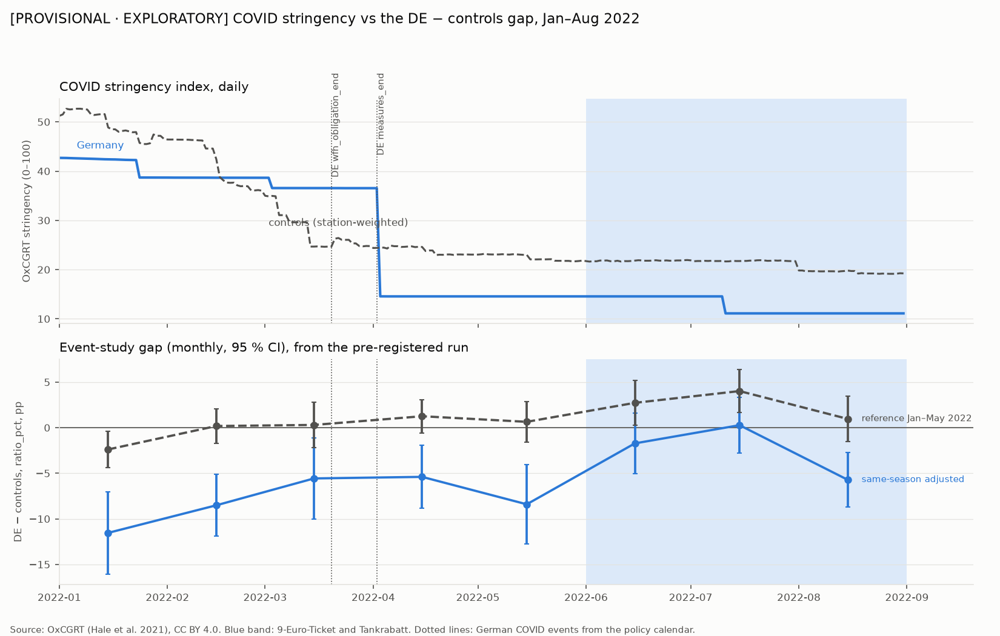
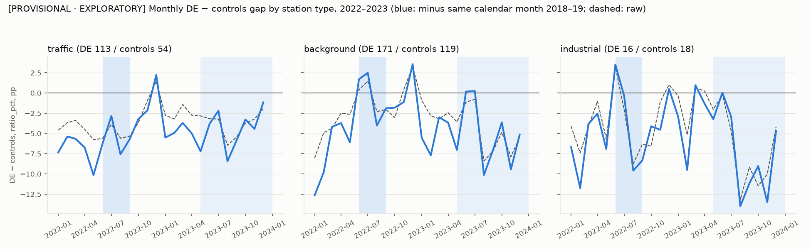

# Post-hoc diagnostics — PROVISIONAL · EXPLORATORY

> **PROVISIONAL.** Same partial control set as docs/results_provisional.md. Do not cite.

> **Post hoc (ADR-009).** Chosen after seeing the provisional result. These analyses cannot change the pre-registered verdict of ADR-008: primary estimate +5.50 pp [+2.88, +8.13], "detected" with the opposite sign to H1. That verdict stands as recorded.

Generated by `analysis/diagnostics_report.py` on 2026-10-06 03:04 UTC from `data/processed/results/diagnostics_*.parquet` (`analysis/diagnostics.py`). Same estimator as ADR-008: station + date FE, two-way clustered CIs (station, country × ISO week), 2018/19 same-season baseline.

## 1) COVID in the reference period

### Policy calendar (COVID events)

| policy | country_code | date | description | verified |
|---|---|---|---|---|
| covid_wfh_obligation_end | DE | 2022-03-20 | Event: federal work-from-home obligation (§ 28b Abs. 4 IfSG a.F.) dropped with the IfSG change in force from 20 March 2022 (last day 19 March). | True |
| covid_measures_end | DE | 2022-04-02 | Event: end of the transition period; most states kept their COVID measures until 2 April 2022 instead of dropping them on 20 March (state-level, not uniform). | True |
| covid_measures_end | AT | 2022-03-05 | Event: bulk of COVID restrictions end on 5 March 2022; FFP2 masks remain in public transport, essential shops. | True |
| covid_measures_end | BE | 2022-03-07 | Event: code yellow from 7 March 2022; all restrictions in hospitality, retail and events dropped, Covid Safe Ticket no longer needed; masks remain on public transport. | True |
| covid_measures_end | CH | 2022-02-17 | Event: from 17 February 2022 no masks or certificates in shops, restaurants, venues; work-from-home recommendation ends; isolation and masks on public transport until end of March. | True |
| covid_measures_end | CZ | 2022-03-01 | Event: limits on public gatherings lifted on 1 March 2022; from 13 March masks only on public transport and in health/care facilities. | True |
| covid_measures_end | FR | 2022-03-14 | Event: vaccine pass and mask obligation end on 14 March 2022 except public transport and health/care settings. | True |
| covid_measures_end | NL | 2022-02-25 | Event: almost all COVID restrictions lifted by 25 February 2022; masks only on public transport and at the airport. | True |
| covid_measures_end | PL | 2022-03-28 | Event: last remaining COVID restrictions (indoor masks outside health care, isolation, quarantine) removed on 28 March 2022. | True |

Sources: `source_url` column of `warehouse/seeds/policy_calendar.csv` (all fetched).

### OxCGRT national stringency index, monthly mean, 2022

| country_code | 2022-01 | 2022-02 | 2022-03 | 2022-04 | 2022-05 | 2022-06 | 2022-07 | 2022-08 |
|---|---|---|---|---|---|---|---|---|
| DE | 41.5 | 38.7 | 36.7 | 16.0 | 14.6 | 14.6 | 12.2 | 11.1 |
| AT | 54.4 | 50.4 | 38.8 | 39.4 | 36.5 | 35.2 | 35.2 | 35.2 |
| BE | 32.2 | 29.9 | 19.6 | 13.9 | 13.1 | 11.1 | 11.1 | 11.1 |
| CH | 54.7 | 35.5 | 14.8 | 11.1 | 11.1 | 11.1 | 11.1 | 8.2 |
| CZ | 37.7 | 36.6 | 32.7 | 15.8 | 14.8 | 14.8 | 14.8 | 11.3 |
| FR | 46.9 | 37.7 | 23.4 | 18.8 | 18.8 | 18.8 | 18.8 | 11.1 |
| NL | 58.2 | 41.2 | 23.5 | 17.6 | 15.7 | 15.7 | 15.7 | 15.7 |
| PL | 45.4 | 42.5 | 21.5 | 14.8 | 14.8 | 14.8 | 14.8 | 12.3 |

OxCGRT `OxCGRT_timeseries_StringencyIndex_v1.csv` (official GitHub repository OxCGRT/covid-policy-dataset), CC BY 4.0, Hale et al. (2021) https://doi.org/10.1038/s41562-021-01079-8. Set to 0 in 2018–19 for the covariate run (no measures existed).

### Primary formula with other references / a stringency covariate

| spec | outcome | estimate | 95 % CI | placebo-country range | would pass the ADR-008 rule (descriptive only) | stations (DE / controls) | station-days |
|---|---|---|---|---|---|---|---|
| reference Jan–May (= primary, for comparison) | ratio_pct | +5.50 | [+2.88, +8.13] | [-6.19, +5.12] (n=7) | yes | 284 / 173 | 329,333 |
| reference Apr–May | ratio_pct | +4.52 | [+1.51, +7.52] | [-8.95, +4.23] (n=7) | yes | 284 / 173 | 207,179 |
| reference 16 Apr–31 May | ratio_pct | +5.20 | [+1.86, +8.54] | [-11.40, +4.79] (n=7) | yes | 284 / 173 | 186,826 |
| reference Jan–May + stringency covariate | ratio_pct | +5.58 | [+2.87, +8.28] | [-6.21, +5.13] (n=7) | yes | 284 / 173 | 329,333 |

Stringency coefficient in the covariate run: +0.015 pp of ratio_pct per index point.

## 2) Mechanism inside stations: commute excess

Weekdays (Mon–Fri, no national public holiday). Per station-day: ratio over local 06:00–09:59 + 16:00–19:59 (≥ 6 of 8 hours) minus ratio over 00:00–03:59 (≥ 3 of 4 hours), each 100 × (Σ observed / Σ predicted − 1). The hour windows are exploratory (ADR-003). **A transport effect predicts a negative estimate.** CH has no traffic stations with predictions yet.

| spec | outcome | estimate | 95 % CI | placebo-country range | would pass the ADR-008 rule (descriptive only) | stations (DE / controls) | station-days |
|---|---|---|---|---|---|---|---|
| traffic, reference Jan–May | commute_excess | -1.66 | [-6.06, +2.74] | [-5.00, +5.63] (n=6) | no | 113 / 54 | 83,106 |
| traffic, reference Apr–May | commute_excess | +3.91 | [-1.63, +9.44] | [-12.90, +6.91] (n=6) | no | 113 / 54 | 51,819 |
| background, reference Jan–May | commute_excess | -2.33 | [-6.84, +2.19] | [-10.48, +6.71] (n=7) | no | 171 / 119 | 144,329 |
| background, reference Apr–May | commute_excess | +5.73 | [+0.53, +10.92] | [-9.49, +14.59] (n=7) | no | 171 / 119 | 89,889 |

No CI for the placebo traffic, reference Jan–May | PL: the two-way clustered variance is negative (very few stations in that country). Its point estimate is still part of the placebo-country range.

## 3) Scale: ratio_pct vs resid_ugm3

| spec | ratio_pct (pp) | resid_ugm3 (µg/m³) | CI excludes 0 (ratio / µg) |
|---|---|---|---|
| primary: €9-Ticket triple difference | +5.50 [+2.88, +8.13] | +0.00 [-0.76, +0.76] | yes / no |
| (a) switch-off Sep–Dec vs Jan–May 2022 | +6.73 [+4.01, +9.45] | +1.11 [+0.26, +1.97] | yes / yes |
| (a) switch-off, controls AT+CH | +9.61 [+4.60, +14.62] | +2.20 [+0.87, +3.54] | yes / yes |
| (b) Deutschlandticket May–Dec vs Jan–Apr 2023 | -0.08 [-2.28, +2.11] | -0.72 [-1.40, -0.05] | no / yes |
| (c) classic TWFE DiD (biased) | -2.50 [-4.79, -0.22] | -1.32 [-2.24, -0.39] | yes / yes |
| (b) persistence 2024 vs Jan–Apr 2023 | -1.40 [-3.02, +0.23] | -0.37 [-0.92, +0.18] | no / no |
| (b) persistence 2024, country trends | +1.33 [-0.27, +2.94] | +0.19 [-0.32, +0.71] | no / no |
| (b) persistence 2025 vs Jan–Apr 2023 | +1.62 [-0.04, +3.27] | +0.16 [-0.42, +0.75] | no / no |
| (b) persistence 2025, country trends | +6.34 [+4.64, +8.04] | +1.11 [+0.51, +1.71] | yes / yes |

Placebo-country ranges were computed only for ratio_pct (ADR-008); the resid_ugm3 column has no placebo comparison and no verdict.

Mean predicted NO2, residual and ratio (station-day means) by period and year:

| group | period | pred_ugm3 2018 | pred_ugm3 2019 | pred_ugm3 2022 | ratio_pct 2018 | ratio_pct 2019 | ratio_pct 2022 | resid_ugm3 2018 | resid_ugm3 2019 | resid_ugm3 2022 |
|---|---|---|---|---|---|---|---|---|---|---|
| DE | Jan–May | 24.68 | 23.80 | 25.92 | 13.52 | 10.94 | -21.56 | 3.39 | 2.47 | -5.73 |
| DE | Jun–Aug | 21.33 | 23.54 | 22.25 | 9.30 | -9.75 | -25.51 | 2.01 | -2.27 | -6.23 |
| controls (pooled) | Jan–May | 26.72 | 25.78 | 27.69 | 9.39 | 9.10 | -16.66 | 2.44 | 2.49 | -4.88 |
| controls (pooled) | Jun–Aug | 19.52 | 21.75 | 20.49 | 7.59 | -8.20 | -23.22 | 1.42 | -1.75 | -4.96 |

**Why the two scales can disagree.** ratio_pct ≈ 100 × residual / predicted, so the same µg/m³ residual is a larger percentage when the predicted level (the denominator) is lower. The triple difference compares Jun–Aug with Jan–May, whose predicted levels differ, and the denominators differ between Germany and the controls and between years. A cross-season contrast that is ≈ 0 in µg/m³ can therefore be clearly non-zero in % (and vice versa), and the mean of daily ratios also weights low-prediction days more. The levels behind the primary estimate:

- DE: predicted 25.9 µg/m³ in Jan–May 2022 vs 22.3 in Jun–Aug 2022; residual -5.73 → -6.23 µg/m³, ratio -21.6 → -25.5 %.
- controls (pooled): predicted 27.7 µg/m³ in Jan–May 2022 vs 20.5 in Jun–Aug 2022; residual -4.88 → -4.96 µg/m³, ratio -16.7 → -23.2 %.

## 4) Energy-crisis hypothesis (descriptive only)

Monthly DE − controls gap in ratio_pct (simple means of station-days), minus the same calendar month's gap averaged over 2018–19; 2022:

| month | background | industrial | traffic |
|---|---|---|---|
| 2022-01 | -12.6 | -6.7 | -7.3 |
| 2022-02 | -9.8 | -11.8 | -5.4 |
| 2022-03 | -4.2 | -3.8 | -5.7 |
| 2022-04 | -3.7 | -2.6 | -6.7 |
| 2022-05 | -6.1 | -6.9 | -10.1 |
| 2022-06 | +1.7 | +3.5 | -6.2 |
| 2022-07 | +2.5 | -0.4 | -2.8 |
| 2022-08 | -4.0 | -9.6 | -7.6 |
| 2022-09 | -1.9 | -8.3 | -5.7 |
| 2022-10 | -1.8 | -4.1 | -3.2 |
| 2022-11 | -1.1 | -4.5 | -2.1 |
| 2022-12 | +3.6 | +0.5 | +2.2 |

**Hypothesis (not tested, not claimed).** If German coal and lignite power generation rose in 2022 as gas was substituted during the energy crisis (to be checked against generation data, not assumed here), extra emissions from large point sources would raise NO2 regionally and at background stations rather than specifically at traffic stations, and on all days of the week; this would push the DE − controls gap up in summer 2022 independently of transport. **Data that would test it:** locations and hourly or monthly generation of German and neighbouring coal/lignite/gas plants (ENTSO-E Transparency Platform, actual generation per unit; EEA E-PRTR / LCP emissions), then the residual as a function of distance to and output of nearby plants, before vs during 2022.

## Interpretation

**Pre-registered verdict (ADR-008), unchanged:** +5.50 pp [+2.88, +8.13], "detected", opposite sign to H1.
**Exploratory evidence (post hoc, provisional):**
- COVID: Germany's stringency stayed above the controls' until early April 2022. Yet an Apr–May
  (+4.52) or 16 Apr–31 May (+5.20) reference, or a stringency covariate (+5.58), barely moves the
  estimate, so these checks do not support "COVID depressed the reference".
- Mechanism: traffic commute excess is −1.66 (Jan–May) and +3.91 (Apr–May), both inside the
  placebo range. There is no transport signature either way.
- Scale: in µg/m³ the primary is +0.00 [−0.76, +0.76]. The % result comes mostly from denominators
  (controls' prediction falls 27.7 → 20.5 µg/m³ into summer, Germany's 25.9 → 22.3).
  Deutschlandticket in µg/m³ is −0.72 [−1.40, −0.05]; it has no placebo comparison, so it is no result.
- Energy: the adjusted gap turns positive in Jun–Jul 2022 at background and industrial stations,
  not at traffic stations. That is consistent with the hypothesis, which remains untested.
