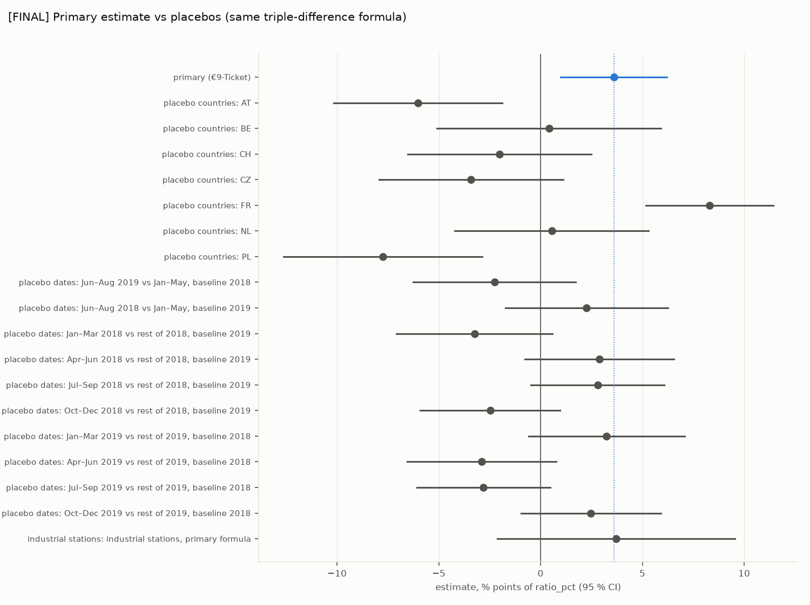
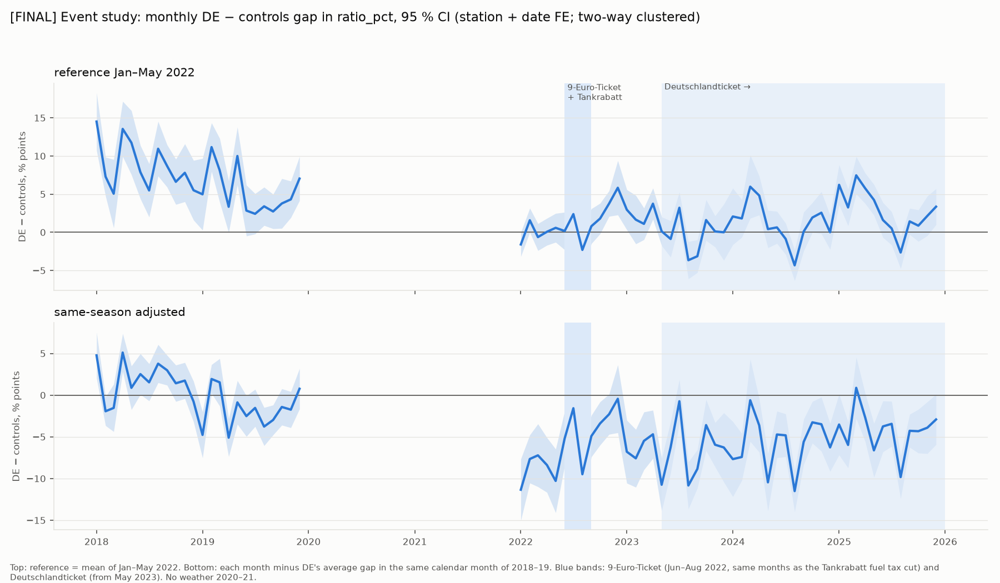
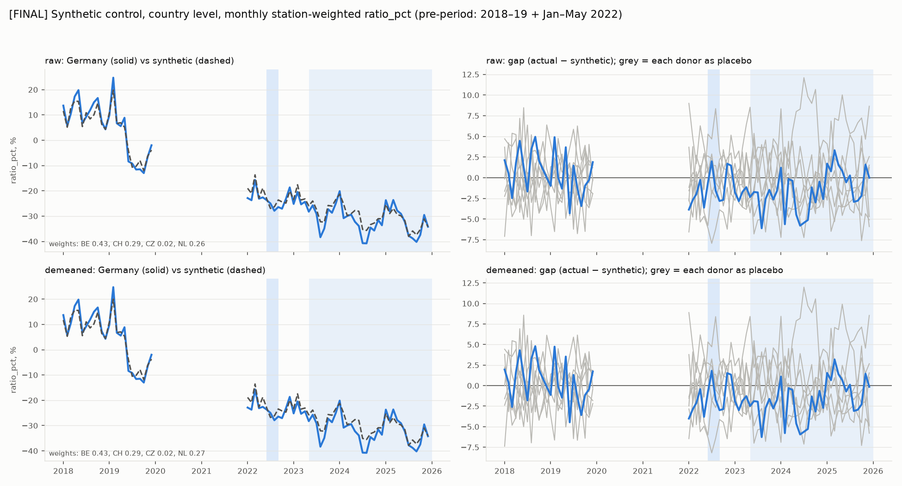

# Results — FINAL

Generated by `analysis/report.py` on 2026-10-06 08:27 UTC from `data/processed/results/` (written by `analysis/causal.py`). Plan: ADR-008 (pre-registered, committed before any estimate). Outcome unit: % points of `ratio_pct` (negative = less NO2 than the weather-and-calendar prediction) unless the outcome column says resid_ugm3 (µg/m³). CIs: two-way clustered (station, country × ISO week). Panel: traffic + background stations, 1,762,413 station-days.

## 1) Decision rule (ADR-008), applied mechanically

Detected = (1) two-way clustered 95 % CI excludes 0 **and** (2) estimate outside the range of the placebo-country estimates of the same formula and outcome.

**Headline: ratio_pct (primary outcome, ADR-008)**

| estimate | outcome | value | 95 % CI | (1) CI excludes 0 | placebo-country range | (2) outside range | verdict | direction |
|---|---|---|---|---|---|---|---|---|
| €9-Ticket: triple difference (Jun–Aug vs Jan–May 2022) | ratio_pct | +3.60 | [+0.98, +6.22] | yes | [-7.76, +8.31] (n=7) | no | not detected | higher NO2 than expected |
| switch-off: Sep–Dec vs Jan–May 2022 | ratio_pct | +6.25 | [+3.72, +8.79] | yes | [-7.97, +5.66] (n=7) | yes | detected | higher NO2 than expected |
| Deutschlandticket: May–Dec vs Jan–Apr 2023 | ratio_pct | -0.54 | [-2.80, +1.72] | no | [-1.55, +1.76] (n=7) | no | not detected | lower NO2 than expected |

**Secondary outcome: resid_ugm3 (ADR-010, added after the provisional run, before the final run).** Reported next to the headline; it never replaces it.

| estimate | outcome | value | 95 % CI | (1) CI excludes 0 | placebo-country range | (2) outside range | verdict | direction |
|---|---|---|---|---|---|---|---|---|
| €9-Ticket: triple difference (Jun–Aug vs Jan–May 2022) | resid_ugm3 | +0.19 | [-0.42, +0.80] | no | [-2.25, +1.47] (n=7) | no | not detected | higher NO2 than expected |
| switch-off: Sep–Dec vs Jan–May 2022 | resid_ugm3 | +1.16 | [+0.42, +1.90] | yes | [-1.87, +1.32] (n=7) | no | not detected | higher NO2 than expected |
| Deutschlandticket: May–Dec vs Jan–Apr 2023 | resid_ugm3 | -0.56 | [-1.17, +0.05] | no | [-0.90, +0.74] (n=7) | no | not detected | lower NO2 than expected |

### Placebo-country ranges for every estimate (ADR-010)

ratio_pct placebo ranges exist for the three rule estimates (ADR-008); resid_ugm3 ranges for every primary, secondary and heterogeneity estimate (ADR-010). Estimates outside the rule are 'not evaluated'.

| id | spec | outcome | estimate | 95 % CI | placebo-country range | rule | verdict |
|---|---|---|---|---|---|---|---|
| nine_euro | €9-Ticket: triple difference (Jun–Aug vs Jan–May 2022) | ratio_pct | +3.60 | [+0.98, +6.22] | [-7.76, +8.31] (n=7) | headline (ADR-008) | not detected |
| nine_euro | €9-Ticket: triple difference (Jun–Aug vs Jan–May 2022) | resid_ugm3 | +0.19 | [-0.42, +0.80] | [-2.25, +1.47] (n=7) | secondary outcome (ADR-010) | not detected |
| switch_off | switch-off: Sep–Dec vs Jan–May 2022 | ratio_pct | +6.25 | [+3.72, +8.79] | [-7.97, +5.66] (n=7) | headline (ADR-008) | detected |
| switch_off | switch-off: Sep–Dec vs Jan–May 2022 | resid_ugm3 | +1.16 | [+0.42, +1.90] | [-1.87, +1.32] (n=7) | secondary outcome (ADR-010) | not detected |
| switch_off_atch | switch-off: Sep–Dec vs Jan–May 2022, controls AT+CH | ratio_pct | +7.30 | [+3.63, +10.98] |  | not applied | not evaluated |
| switch_off_atch | switch-off: Sep–Dec vs Jan–May 2022, controls AT+CH | resid_ugm3 | +1.37 | [+0.27, +2.47] | [-1.20, +1.20] (n=2) | not applied | not evaluated |
| dticket | Deutschlandticket: May–Dec vs Jan–Apr 2023 | ratio_pct | -0.54 | [-2.80, +1.72] | [-1.55, +1.76] (n=7) | headline (ADR-008) | not detected |
| dticket | Deutschlandticket: May–Dec vs Jan–Apr 2023 | resid_ugm3 | -0.56 | [-1.17, +0.05] | [-0.90, +0.74] (n=7) | secondary outcome (ADR-010) | not detected |
| persist_2024 | persistence: 2024 vs Jan–Apr 2023 | ratio_pct | -1.05 | [-2.65, +0.56] |  | not applied | not evaluated |
| persist_2024 | persistence: 2024 vs Jan–Apr 2023 | resid_ugm3 | -0.79 | [-1.25, -0.32] | [-0.67, +0.90] (n=7) | not applied | not evaluated |
| persist_2024_trend | persistence: 2024 vs Jan–Apr 2023, country trends | ratio_pct | +2.18 | [+0.61, +3.75] |  | not applied | not evaluated |
| persist_2024_trend | persistence: 2024 vs Jan–Apr 2023, country trends | resid_ugm3 | +0.27 | [-0.19, +0.73] | [-0.47, +0.85] (n=7) | not applied | not evaluated |
| persist_2025 | persistence: 2025 vs Jan–Apr 2023 | ratio_pct | +0.51 | [-1.08, +2.11] |  | not applied | not evaluated |
| persist_2025 | persistence: 2025 vs Jan–Apr 2023 | resid_ugm3 | -0.48 | [-0.95, -0.01] | [-0.86, +1.01] (n=7) | not applied | not evaluated |
| persist_2025_trend | persistence: 2025 vs Jan–Apr 2023, country trends | ratio_pct | +6.17 | [+4.59, +7.74] |  | not applied | not evaluated |
| persist_2025_trend | persistence: 2025 vs Jan–Apr 2023, country trends | resid_ugm3 | +1.37 | [+0.91, +1.84] | [-1.15, +1.62] (n=7) | not applied | not evaluated |
| classic_twfe | classic TWFE DiD: Jun–Aug 2022 vs full pre-period (BIASED by pre-trend) | ratio_pct | -5.73 | [-7.86, -3.59] |  | not applied | not evaluated |
| classic_twfe | classic TWFE DiD: Jun–Aug 2022 vs full pre-period (BIASED by pre-trend) | resid_ugm3 | -2.53 | [-3.25, -1.81] | [-2.46, +1.05] (n=7) | not applied | not evaluated |
| traffic | traffic stations | ratio_pct | +1.54 | [-1.08, +4.16] |  | not applied | not evaluated |
| traffic | traffic stations | resid_ugm3 | -0.72 | [-1.72, +0.28] | [-1.84, +1.69] (n=7) | not applied | not evaluated |
| background | background stations | ratio_pct | +4.39 | [+1.31, +7.47] |  | not applied | not evaluated |
| background | background stations | resid_ugm3 | +0.48 | [-0.07, +1.02] | [-2.23, +1.42] (n=7) | not applied | not evaluated |
| weekday | weekdays (Mon–Fri) | ratio_pct | +3.29 | [+0.58, +6.00] |  | not applied | not evaluated |
| weekday | weekdays (Mon–Fri) | resid_ugm3 | +0.14 | [-0.53, +0.82] | [-2.42, +1.49] (n=7) | not applied | not evaluated |
| weekend | weekends (Sat–Sun) | ratio_pct | +4.34 | [+0.57, +8.12] |  | not applied | not evaluated |
| weekend | weekends (Sat–Sun) | resid_ugm3 | +0.31 | [-0.39, +1.01] | [-1.86, +1.43] (n=7) | not applied | not evaluated |

## 2) Every estimate

Triple differences: [gap(window) − gap(reference)] in the policy year minus the same change averaged over 2018 and 2019; gap = regression-adjusted DE − controls (station + date FE). Placebo countries: that country as treated, the other controls as controls, DE excluded.

| family | spec | outcome | estimate | 95 % CI | stations (DE / controls) | station-days | dates |
|---|---|---|---|---|---|---|---|
| primary | €9-Ticket: triple difference (Jun–Aug vs Jan–May 2022) | ratio_pct | +3.60 | [+0.98, +6.22] | 833 (284 / 549) | 597,543 | 729 |
| primary | €9-Ticket: triple difference (Jun–Aug vs Jan–May 2022) | resid_ugm3 | +0.19 | [-0.42, +0.80] | 833 (284 / 549) | 597,551 | 729 |
| secondary (a) | switch-off: Sep–Dec vs Jan–May 2022 | ratio_pct | +6.25 | [+3.72, +8.79] | 833 (284 / 549) | 672,232 | 819 |
| secondary (a) | switch-off: Sep–Dec vs Jan–May 2022 | resid_ugm3 | +1.16 | [+0.42, +1.90] | 833 (284 / 549) | 672,244 | 819 |
| secondary (a) | switch-off: Sep–Dec vs Jan–May 2022, controls AT+CH | ratio_pct | +7.30 | [+3.63, +10.98] | 397 (284 / 113) | 323,184 | 819 |
| secondary (a) | switch-off: Sep–Dec vs Jan–May 2022, controls AT+CH | resid_ugm3 | +1.37 | [+0.27, +2.47] | 397 (284 / 113) | 323,184 | 819 |
| secondary (b) | Deutschlandticket: May–Dec vs Jan–Apr 2023 | ratio_pct | -0.54 | [-2.80, +1.72] | 833 (284 / 549) | 898,057 | 1095 |
| secondary (b) | Deutschlandticket: May–Dec vs Jan–Apr 2023 | resid_ugm3 | -0.56 | [-1.17, +0.05] | 833 (284 / 549) | 898,074 | 1095 |
| secondary (b) | persistence: 2024 vs Jan–Apr 2023 | ratio_pct | -1.05 | [-2.65, +0.56] | 833 (284 / 549) | 386,551 | 486 |
| secondary (b) | persistence: 2024 vs Jan–Apr 2023 | resid_ugm3 | -0.79 | [-1.25, -0.32] | 833 (284 / 549) | 386,553 | 486 |
| secondary (b) | persistence: 2024 vs Jan–Apr 2023, country trends | ratio_pct | +2.18 | [+0.61, +3.75] | 833 (284 / 549) | 386,551 | 486 |
| secondary (b) | persistence: 2024 vs Jan–Apr 2023, country trends | resid_ugm3 | +0.27 | [-0.19, +0.73] | 833 (284 / 549) | 386,553 | 486 |
| secondary (b) | persistence: 2025 vs Jan–Apr 2023 | ratio_pct | +0.51 | [-1.08, +2.11] | 833 (284 / 549) | 375,764 | 485 |
| secondary (b) | persistence: 2025 vs Jan–Apr 2023 | resid_ugm3 | -0.48 | [-0.95, -0.01] | 833 (284 / 549) | 375,765 | 485 |
| secondary (b) | persistence: 2025 vs Jan–Apr 2023, country trends | ratio_pct | +6.17 | [+4.59, +7.74] | 833 (284 / 549) | 375,764 | 485 |
| secondary (b) | persistence: 2025 vs Jan–Apr 2023, country trends | resid_ugm3 | +1.37 | [+0.91, +1.84] | 833 (284 / 549) | 375,765 | 485 |
| secondary (c) | classic TWFE DiD: Jun–Aug 2022 vs full pre-period (BIASED by pre-trend) | ratio_pct | -5.73 | [-7.86, -3.59] | 833 (284 / 549) | 797,782 | 973 |
| secondary (c) | classic TWFE DiD: Jun–Aug 2022 vs full pre-period (BIASED by pre-trend) | resid_ugm3 | -2.53 | [-3.25, -1.81] | 833 (284 / 549) | 797,795 | 973 |
| heterogeneity | traffic stations | ratio_pct | +1.54 | [-1.08, +4.16] | 267 (113 / 154) | 191,690 | 729 |
| heterogeneity | traffic stations | resid_ugm3 | -0.72 | [-1.72, +0.28] | 267 (113 / 154) | 191,690 | 729 |
| heterogeneity | background stations | ratio_pct | +4.39 | [+1.31, +7.47] | 566 (171 / 395) | 405,853 | 729 |
| heterogeneity | background stations | resid_ugm3 | +0.48 | [-0.07, +1.02] | 566 (171 / 395) | 405,861 | 729 |
| heterogeneity | weekdays (Mon–Fri) | ratio_pct | +3.29 | [+0.58, +6.00] | 833 (284 / 549) | 427,431 | 522 |
| heterogeneity | weekdays (Mon–Fri) | resid_ugm3 | +0.14 | [-0.53, +0.82] | 833 (284 / 549) | 427,437 | 522 |
| heterogeneity | weekends (Sat–Sun) | ratio_pct | +4.34 | [+0.57, +8.12] | 833 (284 / 549) | 170,112 | 207 |
| heterogeneity | weekends (Sat–Sun) | resid_ugm3 | +0.31 | [-0.39, +1.01] | 833 (284 / 549) | 170,114 | 207 |
| placebo country: primary | AT | ratio_pct | -6.02 | [-10.16, -1.89] | 549 (91 / 458) | 392,042 | 729 |
| placebo country: primary | BE | ratio_pct | +0.41 | [-5.08, +5.91] | 549 (23 / 526) | 392,042 | 729 |
| placebo country: primary | CH | ratio_pct | -2.01 | [-6.53, +2.50] | 549 (22 / 527) | 392,042 | 729 |
| placebo country: primary | CZ | ratio_pct | -3.41 | [-7.94, +1.12] | 549 (45 / 504) | 392,042 | 729 |
| placebo country: primary | FR | ratio_pct | +8.31 | [+5.18, +11.44] | 549 (253 / 296) | 392,042 | 729 |
| placebo country: primary | NL | ratio_pct | +0.55 | [-4.21, +5.31] | 549 (39 / 510) | 392,042 | 729 |
| placebo country: primary | PL | ratio_pct | -7.76 | [-12.64, -2.88] | 549 (76 / 473) | 392,042 | 729 |
| placebo country (resid_ugm3) | AT | resid_ugm3 | -0.29 | [-1.25, +0.67] | 549 (91 / 458) | 392,049 | 729 |
| placebo country (resid_ugm3) | BE | resid_ugm3 | +0.66 | [-0.55, +1.88] | 549 (23 / 526) | 392,049 | 729 |
| placebo country (resid_ugm3) | CH | resid_ugm3 | -0.00 | [-1.08, +1.07] | 549 (22 / 527) | 392,049 | 729 |
| placebo country (resid_ugm3) | CZ | resid_ugm3 | -1.37 | [-2.19, -0.56] | 549 (45 / 504) | 392,049 | 729 |
| placebo country (resid_ugm3) | FR | resid_ugm3 | +1.47 | [+0.78, +2.16] | 549 (253 / 296) | 392,049 | 729 |
| placebo country (resid_ugm3) | NL | resid_ugm3 | +0.37 | [-0.71, +1.46] | 549 (39 / 510) | 392,049 | 729 |
| placebo country (resid_ugm3) | PL | resid_ugm3 | -2.25 | [-3.23, -1.27] | 549 (76 / 473) | 392,049 | 729 |
| placebo country: switch-off | AT | ratio_pct | -2.11 | [-6.41, +2.20] | 549 (91 / 458) | 441,139 | 819 |
| placebo country: switch-off | BE | ratio_pct | +5.66 | [+0.52, +10.79] | 549 (23 / 526) | 441,139 | 819 |
| placebo country: switch-off | CH | ratio_pct | +1.92 | [-3.38, +7.22] | 549 (22 / 527) | 441,139 | 819 |
| placebo country: switch-off | CZ | ratio_pct | -2.13 | [-6.59, +2.32] | 549 (45 / 504) | 441,139 | 819 |
| placebo country: switch-off | FR | ratio_pct | +3.54 | [+0.46, +6.62] | 549 (253 / 296) | 441,139 | 819 |
| placebo country: switch-off | NL | ratio_pct | +3.55 | [-0.46, +7.56] | 549 (39 / 510) | 441,139 | 819 |
| placebo country: switch-off | PL | ratio_pct | -7.97 | [-12.37, -3.57] | 549 (76 / 473) | 441,139 | 819 |
| placebo country (resid_ugm3) | AT | resid_ugm3 | -0.53 | [-1.66, +0.59] | 549 (91 / 458) | 441,151 | 819 |
| placebo country (resid_ugm3) | BE | resid_ugm3 | +1.32 | [-0.04, +2.67] | 549 (23 / 526) | 441,151 | 819 |
| placebo country (resid_ugm3) | CH | resid_ugm3 | +0.79 | [-0.71, +2.29] | 549 (22 / 527) | 441,151 | 819 |
| placebo country (resid_ugm3) | CZ | resid_ugm3 | -1.07 | [-2.10, -0.04] | 549 (45 / 504) | 441,151 | 819 |
| placebo country (resid_ugm3) | FR | resid_ugm3 | +1.15 | [+0.38, +1.93] | 549 (253 / 296) | 441,151 | 819 |
| placebo country (resid_ugm3) | NL | resid_ugm3 | +0.18 | [-0.97, +1.34] | 549 (39 / 510) | 441,151 | 819 |
| placebo country (resid_ugm3) | PL | resid_ugm3 | -1.87 | [-2.86, -0.88] | 549 (76 / 473) | 441,151 | 819 |
| placebo country (resid_ugm3) | AT | resid_ugm3 | -1.20 | [-2.75, +0.34] | 113 (91 / 22) | 92,091 | 819 |
| placebo country (resid_ugm3) | CH | resid_ugm3 | +1.20 | [-0.34, +2.75] | 113 (22 / 91) | 92,091 | 819 |
| placebo country: Deutschlandticket | AT | ratio_pct | -0.89 | [-4.78, +3.00] | 549 (91 / 458) | 589,140 | 1095 |
| placebo country: Deutschlandticket | BE | ratio_pct | -0.55 | [-5.04, +3.95] | 549 (23 / 526) | 589,140 | 1095 |
| placebo country: Deutschlandticket | CH | ratio_pct | +1.76 | [-2.38, +5.89] | 549 (22 / 527) | 589,140 | 1095 |
| placebo country: Deutschlandticket | CZ | ratio_pct | -1.55 | [-4.83, +1.72] | 549 (45 / 504) | 589,140 | 1095 |
| placebo country: Deutschlandticket | FR | ratio_pct | +1.39 | [-1.37, +4.15] | 549 (253 / 296) | 589,140 | 1095 |
| placebo country: Deutschlandticket | NL | ratio_pct | +0.46 | [-3.14, +4.07] | 549 (39 / 510) | 589,140 | 1095 |
| placebo country: Deutschlandticket | PL | ratio_pct | -1.44 | [-6.01, +3.13] | 549 (76 / 473) | 589,140 | 1095 |
| placebo country (resid_ugm3) | AT | resid_ugm3 | +0.74 | [-0.30, +1.79] | 549 (91 / 458) | 589,155 | 1095 |
| placebo country (resid_ugm3) | BE | resid_ugm3 | +0.46 | [-0.77, +1.69] | 549 (23 / 526) | 589,155 | 1095 |
| placebo country (resid_ugm3) | CH | resid_ugm3 | +0.60 | [-0.44, +1.64] | 549 (22 / 527) | 589,155 | 1095 |
| placebo country (resid_ugm3) | CZ | resid_ugm3 | -0.66 | [-1.43, +0.10] | 549 (45 / 504) | 589,155 | 1095 |
| placebo country (resid_ugm3) | FR | resid_ugm3 | +0.05 | [-0.63, +0.73] | 549 (253 / 296) | 589,155 | 1095 |
| placebo country (resid_ugm3) | NL | resid_ugm3 | +0.02 | [-1.01, +1.06] | 549 (39 / 510) | 589,155 | 1095 |
| placebo country (resid_ugm3) | PL | resid_ugm3 | -0.90 | [-1.80, +0.01] | 549 (76 / 473) | 589,155 | 1095 |
| placebo country (resid_ugm3) | AT | resid_ugm3 | +0.76 | [-0.01, +1.54] | 549 (91 / 458) | 251,170 | 486 |
| placebo country (resid_ugm3) | BE | resid_ugm3 | -0.57 | [-1.52, +0.37] | 549 (23 / 526) | 251,170 | 486 |
| placebo country (resid_ugm3) | CH | resid_ugm3 | -0.06 | [-0.84, +0.72] | 549 (22 / 527) | 251,170 | 486 |
| placebo country (resid_ugm3) | CZ | resid_ugm3 | +0.17 | [-0.48, +0.83] | 549 (45 / 504) | 251,170 | 486 |
| placebo country (resid_ugm3) | FR | resid_ugm3 | -0.67 | [-1.17, -0.16] | 549 (253 / 296) | 251,170 | 486 |
| placebo country (resid_ugm3) | NL | resid_ugm3 | -0.52 | [-1.32, +0.28] | 549 (39 / 510) | 251,170 | 486 |
| placebo country (resid_ugm3) | PL | resid_ugm3 | +0.90 | [+0.13, +1.68] | 549 (76 / 473) | 251,170 | 486 |
| placebo country (resid_ugm3) | AT | resid_ugm3 | +0.85 | [+0.08, +1.62] | 549 (91 / 458) | 251,170 | 486 |
| placebo country (resid_ugm3) | BE | resid_ugm3 | +0.55 | [-0.38, +1.48] | 549 (23 / 526) | 251,170 | 486 |
| placebo country (resid_ugm3) | CH | resid_ugm3 | +0.34 | [-0.44, +1.12] | 549 (22 / 527) | 251,170 | 486 |
| placebo country (resid_ugm3) | CZ | resid_ugm3 | -0.47 | [-1.14, +0.19] | 549 (45 / 504) | 251,170 | 486 |
| placebo country (resid_ugm3) | FR | resid_ugm3 | -0.40 | [-0.90, +0.11] | 549 (253 / 296) | 251,170 | 486 |
| placebo country (resid_ugm3) | NL | resid_ugm3 | -0.03 | [-0.82, +0.76] | 549 (39 / 510) | 251,170 | 486 |
| placebo country (resid_ugm3) | PL | resid_ugm3 | -0.16 | [-0.92, +0.61] | 549 (76 / 473) | 251,170 | 486 |
| placebo country (resid_ugm3) | AT | resid_ugm3 | +0.37 | [-0.47, +1.20] | 549 (91 / 458) | 242,090 | 485 |
| placebo country (resid_ugm3) | BE | resid_ugm3 | -0.35 | [-1.31, +0.61] | 549 (23 / 526) | 242,090 | 485 |
| placebo country (resid_ugm3) | CH | resid_ugm3 | -0.81 | [-1.70, +0.08] | 549 (22 / 527) | 242,090 | 485 |
| placebo country (resid_ugm3) | CZ | resid_ugm3 | -0.02 | [-0.72, +0.67] | 549 (45 / 504) | 242,090 | 485 |
| placebo country (resid_ugm3) | FR | resid_ugm3 | -0.24 | [-0.81, +0.33] | 549 (253 / 296) | 242,090 | 485 |
| placebo country (resid_ugm3) | NL | resid_ugm3 | -0.86 | [-1.77, +0.05] | 549 (39 / 510) | 242,090 | 485 |
| placebo country (resid_ugm3) | PL | resid_ugm3 | +1.01 | [+0.26, +1.76] | 549 (76 / 473) | 242,090 | 485 |
| placebo country (resid_ugm3) | AT | resid_ugm3 | +0.52 | [-0.32, +1.36] | 549 (91 / 458) | 242,090 | 485 |
| placebo country (resid_ugm3) | BE | resid_ugm3 | +1.62 | [+0.67, +2.58] | 549 (23 / 526) | 242,090 | 485 |
| placebo country (resid_ugm3) | CH | resid_ugm3 | -0.11 | [-1.01, +0.78] | 549 (22 / 527) | 242,090 | 485 |
| placebo country (resid_ugm3) | CZ | resid_ugm3 | -1.15 | [-1.86, -0.44] | 549 (45 / 504) | 242,090 | 485 |
| placebo country (resid_ugm3) | FR | resid_ugm3 | +0.22 | [-0.36, +0.80] | 549 (253 / 296) | 242,090 | 485 |
| placebo country (resid_ugm3) | NL | resid_ugm3 | +0.01 | [-0.90, +0.91] | 549 (39 / 510) | 242,090 | 485 |
| placebo country (resid_ugm3) | PL | resid_ugm3 | -0.86 | [-1.61, -0.11] | 549 (76 / 473) | 242,090 | 485 |
| placebo country (resid_ugm3) | AT | resid_ugm3 | -0.38 | [-1.07, +0.31] | 549 (91 / 458) | 523,306 | 973 |
| placebo country (resid_ugm3) | BE | resid_ugm3 | -2.46 | [-3.90, -1.02] | 549 (23 / 526) | 523,306 | 973 |
| placebo country (resid_ugm3) | CH | resid_ugm3 | -1.09 | [-2.49, +0.31] | 549 (22 / 527) | 523,306 | 973 |
| placebo country (resid_ugm3) | CZ | resid_ugm3 | +0.66 | [-0.22, +1.55] | 549 (45 / 504) | 523,306 | 973 |
| placebo country (resid_ugm3) | FR | resid_ugm3 | +0.38 | [-0.31, +1.06] | 549 (253 / 296) | 523,306 | 973 |
| placebo country (resid_ugm3) | NL | resid_ugm3 | -1.11 | [-1.94, -0.27] | 549 (39 / 510) | 523,306 | 973 |
| placebo country (resid_ugm3) | PL | resid_ugm3 | +1.05 | [+0.24, +1.86] | 549 (76 / 473) | 523,306 | 973 |
| placebo country (resid_ugm3) | AT | resid_ugm3 | -0.77 | [-2.35, +0.82] | 154 (28 / 126) | 109,901 | 729 |
| placebo country (resid_ugm3) | BE | resid_ugm3 | +1.31 | [-0.15, +2.76] | 154 (4 / 150) | 109,901 | 729 |
| placebo country (resid_ugm3) | CH | resid_ugm3 | -0.90 | [-2.69, +0.89] | 154 (9 / 145) | 109,901 | 729 |
| placebo country (resid_ugm3) | CZ | resid_ugm3 | -1.84 | [-3.27, -0.40] | 154 (12 / 142) | 109,901 | 729 |
| placebo country (resid_ugm3) | FR | resid_ugm3 | +1.69 | [+0.35, +3.03] | 154 (69 / 85) | 109,901 | 729 |
| placebo country (resid_ugm3) | NL | resid_ugm3 | -0.59 | [-2.01, +0.83] | 154 (20 / 134) | 109,901 | 729 |
| placebo country (resid_ugm3) | PL | resid_ugm3 | -1.25 | [-4.20, +1.70] | 154 (12 / 142) | 109,901 | 729 |
| placebo country (resid_ugm3) | AT | resid_ugm3 | -0.17 | [-1.11, +0.77] | 395 (63 / 332) | 282,148 | 729 |
| placebo country (resid_ugm3) | BE | resid_ugm3 | +0.69 | [-0.51, +1.89] | 395 (19 / 376) | 282,148 | 729 |
| placebo country (resid_ugm3) | CH | resid_ugm3 | +0.25 | [-0.60, +1.11] | 395 (13 / 382) | 282,148 | 729 |
| placebo country (resid_ugm3) | CZ | resid_ugm3 | -1.15 | [-1.90, -0.40] | 395 (33 / 362) | 282,148 | 729 |
| placebo country (resid_ugm3) | FR | resid_ugm3 | +1.42 | [+0.80, +2.03] | 395 (184 / 211) | 282,148 | 729 |
| placebo country (resid_ugm3) | NL | resid_ugm3 | +0.56 | [-0.55, +1.68] | 395 (19 / 376) | 282,148 | 729 |
| placebo country (resid_ugm3) | PL | resid_ugm3 | -2.23 | [-3.07, -1.38] | 395 (64 / 331) | 282,148 | 729 |
| placebo country (resid_ugm3) | AT | resid_ugm3 | -0.17 | [-1.24, +0.90] | 549 (91 / 458) | 280,351 | 522 |
| placebo country (resid_ugm3) | BE | resid_ugm3 | +0.53 | [-0.94, +2.01] | 549 (23 / 526) | 280,351 | 522 |
| placebo country (resid_ugm3) | CH | resid_ugm3 | +0.06 | [-1.17, +1.29] | 549 (22 / 527) | 280,351 | 522 |
| placebo country (resid_ugm3) | CZ | resid_ugm3 | -1.35 | [-2.27, -0.43] | 549 (45 / 504) | 280,351 | 522 |
| placebo country (resid_ugm3) | FR | resid_ugm3 | +1.49 | [+0.71, +2.27] | 549 (253 / 296) | 280,351 | 522 |
| placebo country (resid_ugm3) | NL | resid_ugm3 | +0.36 | [-0.98, +1.71] | 549 (39 / 510) | 280,351 | 522 |
| placebo country (resid_ugm3) | PL | resid_ugm3 | -2.42 | [-3.52, -1.31] | 549 (76 / 473) | 280,351 | 522 |
| placebo country (resid_ugm3) | AT | resid_ugm3 | -0.59 | [-1.64, +0.46] | 549 (91 / 458) | 111,698 | 207 |
| placebo country (resid_ugm3) | BE | resid_ugm3 | +0.98 | [-0.44, +2.40] | 549 (23 / 526) | 111,698 | 207 |
| placebo country (resid_ugm3) | CH | resid_ugm3 | -0.13 | [-1.78, +1.51] | 549 (22 / 527) | 111,698 | 207 |
| placebo country (resid_ugm3) | CZ | resid_ugm3 | -1.44 | [-2.45, -0.42] | 549 (45 / 504) | 111,698 | 207 |
| placebo country (resid_ugm3) | FR | resid_ugm3 | +1.43 | [+0.62, +2.24] | 549 (253 / 296) | 111,698 | 207 |
| placebo country (resid_ugm3) | NL | resid_ugm3 | +0.38 | [-0.91, +1.68] | 549 (39 / 510) | 111,698 | 207 |
| placebo country (resid_ugm3) | PL | resid_ugm3 | -1.86 | [-2.99, -0.73] | 549 (76 / 473) | 111,698 | 207 |
| placebo industrial | industrial stations, primary formula | ratio_pct | +3.71 | [-2.12, +9.55] | 54 (16 / 38) | 38,682 | 729 |
| placebo date | Jun–Aug 2019 vs Jan–May, baseline 2018 | ratio_pct | -2.27 | [-6.27, +1.74] | 833 (284 / 549) | 398,405 | 486 |
| placebo date | Jun–Aug 2018 vs Jan–May, baseline 2019 | ratio_pct | +2.27 | [-1.74, +6.27] | 833 (284 / 549) | 398,405 | 486 |
| placebo date | Jan–Mar 2018 vs rest of 2018, baseline 2019 | ratio_pct | -3.25 | [-7.08, +0.59] | 833 (284 / 549) | 598,644 | 730 |
| placebo date | Apr–Jun 2018 vs rest of 2018, baseline 2019 | ratio_pct | +2.89 | [-0.76, +6.55] | 833 (284 / 549) | 598,644 | 730 |
| placebo date | Jul–Sep 2018 vs rest of 2018, baseline 2019 | ratio_pct | +2.81 | [-0.47, +6.08] | 833 (284 / 549) | 598,644 | 730 |
| placebo date | Oct–Dec 2018 vs rest of 2018, baseline 2019 | ratio_pct | -2.48 | [-5.92, +0.97] | 833 (284 / 549) | 598,644 | 730 |
| placebo date | Jan–Mar 2019 vs rest of 2019, baseline 2018 | ratio_pct | +3.25 | [-0.59, +7.08] | 833 (284 / 549) | 598,644 | 730 |
| placebo date | Apr–Jun 2019 vs rest of 2019, baseline 2018 | ratio_pct | -2.89 | [-6.55, +0.76] | 833 (284 / 549) | 598,644 | 730 |
| placebo date | Jul–Sep 2019 vs rest of 2019, baseline 2018 | ratio_pct | -2.81 | [-6.08, +0.47] | 833 (284 / 549) | 598,644 | 730 |
| placebo date | Oct–Dec 2019 vs rest of 2019, baseline 2018 | ratio_pct | +2.48 | [-0.97, +5.92] | 833 (284 / 549) | 598,644 | 730 |
| robustness | ratio_noblh (no-BLH prediction everywhere) | ratio_noblh | +4.11 | [+1.14, +7.09] | 833 (284 / 549) | 597,545 | 729 |
| robustness | leave out AT | ratio_pct | +2.59 | [-0.08, +5.26] | 742 (284 / 458) | 531,650 | 729 |
| robustness | leave out BE | ratio_pct | +3.61 | [+0.95, +6.27] | 810 (284 / 526) | 581,213 | 729 |
| robustness | leave out CH | ratio_pct | +3.52 | [+0.86, +6.17] | 811 (284 / 527) | 581,590 | 729 |
| robustness | leave out CZ | ratio_pct | +3.32 | [+0.63, +6.00] | 788 (284 / 504) | 565,392 | 729 |
| robustness | leave out FR | ratio_pct | +7.40 | [+4.81, +9.98] | 580 (284 / 296) | 418,301 | 729 |
| robustness | leave out NL | ratio_pct | +3.64 | [+0.91, +6.37] | 794 (284 / 510) | 569,516 | 729 |
| robustness | leave out PL | ratio_pct | +2.52 | [-0.13, +5.18] | 757 (284 / 473) | 543,097 | 729 |
| robustness | drop FR | ratio_pct | +7.40 | [+4.81, +9.98] | 580 (284 / 296) | 418,301 | 729 |
| robustness | country-balanced weights | ratio_pct | +5.24 | [+2.48, +8.00] | 833 (284 / 549) | 597,543 | 729 |
| robustness | controls with 2022 fuel cuts (FR, NL, BE, PL, CZ) | ratio_pct | +2.44 | [-0.28, +5.16] | 720 (284 / 436) | 515,697 | 729 |
| robustness | controls without 2022 fuel cuts (AT, CH) | ratio_pct | +8.01 | [+4.77, +11.26] | 397 (284 / 113) | 287,347 | 729 |
| robustness | station × month-of-year FE | ratio_pct | +3.55 | [+0.93, +6.16] | 833 (284 / 549) | 597,543 | 729 |

**Wild cluster bootstrap by country, primary estimate** (restricted, Webb weights, 9,999 draws, 8 clusters, seed 42): estimate +3.60, p = 0.383, 95 % CI by test inversion [-8.16, +20.09]. With one treated cluster this bootstrap is known to be unreliable (ADR-008); it is not part of the decision rule.

**Country-specific linear trends** used in the trend-adjusted persistence runs (fitted on the 29 pre-treatment months; slopes relative to AT, per year: % points for ratio_pct, µg/m³ for resid_ugm3):

| country_code | ratio_pct | resid_ugm3 |
|---|---|---|
| AT | +0.00 | +0.00 |
| BE | -2.17 | -0.76 |
| CH | -0.15 | -0.23 |
| CZ | +1.03 | +0.50 |
| DE | -2.14 | -0.74 |
| FR | -0.02 | -0.06 |
| NL | -0.59 | -0.29 |
| PL | +2.57 | +0.74 |

## 3) Placebo distributions (primary formula)

| distribution | min | max | mean | SD | |estimate| ≥ |primary| |
|---|---|---|---|---|---|
| placebo countries (7) | -7.76 | +8.31 | -1.42 | 5.28 | 3 |
| placebo dates (10; mirror pairs → 5 magnitudes) | -3.25 | +3.25 | +0.00 | 2.91 | 0 |

## 4) Event study

Jan 2022 – Jun 2023 (all 72 months in `dashboard/data/event_study.json`):

| month | reference Jan–May 2022 | same-season adjusted |
|---|---|---|
| 2022-01 | -1.60 [-3.17, -0.02] | -11.34 [-15.02, -7.66] |
| 2022-02 | +1.57 [-0.00, +3.15] | -7.66 [-10.54, -4.77] |
| 2022-03 | -0.63 [-2.39, +1.14] | -7.22 [-10.99, -3.45] |
| 2022-04 | +0.07 [-1.70, +1.83] | -8.38 [-11.66, -5.10] |
| 2022-05 | +0.58 [-1.30, +2.47] | -10.29 [-14.10, -6.47] |
| 2022-06 | +0.17 [-2.29, +2.63] | -5.19 [-8.46, -1.92] |
| 2022-07 | +2.38 [+0.23, +4.53] | -1.57 [-4.40, +1.25] |
| 2022-08 | -2.31 [-5.28, +0.67] | -9.48 [-12.85, -6.12] |
| 2022-09 | +0.80 [-1.49, +3.08] | -4.91 [-7.40, -2.42] |
| 2022-10 | +1.80 [-0.20, +3.80] | -3.39 [-5.99, -0.80] |
| 2022-11 | +3.76 [+2.09, +5.44] | -2.29 [-4.70, +0.11] |
| 2022-12 | +5.83 [+2.27, +9.40] | -0.44 [-4.51, +3.63] |
| 2023-01 | +2.96 [+0.33, +5.58] | -6.79 [-10.56, -3.02] |
| 2023-02 | +1.65 [-1.52, +4.83] | -7.58 [-11.04, -4.11] |
| 2023-03 | +1.10 [-0.97, +3.18] | -5.49 [-8.95, -2.02] |
| 2023-04 | +3.75 [+1.70, +5.80] | -4.70 [-7.59, -1.81] |
| 2023-05 | +0.13 [-1.75, +2.01] | -10.74 [-13.89, -7.60] |
| 2023-06 | -0.88 [-3.26, +1.51] | -6.24 [-9.33, -3.15] |

## 5) Synthetic control (country level)

Donor weights for Germany:

| donor | demeaned | raw |
|---|---|---|
| AT | 0.000 | 0.000 |
| BE | 0.429 | 0.433 |
| CH | 0.285 | 0.286 |
| CZ | 0.018 | 0.019 |
| FR | 0.000 | 0.000 |
| NL | 0.267 | 0.262 |
| PL | 0.000 | 0.000 |

Post/pre RMSPE ratio and rank among 8 units (rank 1 = largest ratio); p = rank / 8. With 7 donors the smallest possible p-value is 1/8 = 0.125. mean_gap = mean of actual − synthetic in the window, % points.

| variant | unit | rmspe_pre | mean_gap Jun–Aug 2022 | ratio Jun–Aug 2022 | rank Jun–Aug 2022 | p Jun–Aug 2022 | mean_gap May–Dec 2023 | ratio May–Dec 2023 | rank May–Dec 2023 | p May–Dec 2023 |
|---|---|---|---|---|---|---|---|---|---|---|
| raw | DE | 2.61 | -0.06 | 0.57 | 6 | 0.75 | -2.53 | 1.11 | 4 | 0.50 |
| raw | AT | 3.04 | -3.25 | 1.22 | 3 | 0.38 | -1.08 | 1.30 | 1 | 0.12 |
| raw | BE | 3.41 | -6.74 | 2.00 | 2 | 0.25 | -2.77 | 1.00 | 5 | 0.62 |
| raw | CH | 3.01 | -0.47 | 0.45 | 7 | 0.88 | 0.52 | 0.95 | 6 | 0.75 |
| raw | CZ | 3.11 | 1.46 | 0.65 | 4 | 0.50 | -0.60 | 0.72 | 8 | 1.00 |
| raw | FR | 2.55 | 6.10 | 2.47 | 1 | 0.12 | 0.72 | 1.18 | 3 | 0.38 |
| raw | NL | 2.65 | 0.98 | 0.65 | 5 | 0.62 | -1.42 | 0.89 | 7 | 0.88 |
| raw | PL | 3.68 | 1.34 | 0.37 | 8 | 1.00 | 3.82 | 1.20 | 2 | 0.25 |
| demeaned | DE | 2.61 | -0.23 | 0.58 | 6 | 0.75 | -2.68 | 1.16 | 4 | 0.50 |
| demeaned | AT | 3.03 | -3.48 | 1.30 | 3 | 0.38 | -1.30 | 1.32 | 1 | 0.12 |
| demeaned | BE | 3.40 | -6.97 | 2.07 | 2 | 0.25 | -3.01 | 1.06 | 5 | 0.62 |
| demeaned | CH | 3.01 | -0.36 | 0.44 | 7 | 0.88 | 0.62 | 0.96 | 6 | 0.75 |
| demeaned | CZ | 3.11 | 1.57 | 0.68 | 5 | 0.62 | -0.49 | 0.71 | 8 | 1.00 |
| demeaned | FR | 2.55 | 6.14 | 2.49 | 1 | 0.12 | 0.75 | 1.18 | 2 | 0.25 |
| demeaned | NL | 2.63 | 1.37 | 0.75 | 4 | 0.50 | -1.07 | 0.83 | 7 | 0.88 |
| demeaned | PL | 3.68 | 1.24 | 0.34 | 8 | 1.00 | 3.72 | 1.18 | 3 | 0.38 |

## 6) Country map data (descriptive, no SE)

Per country: [mean ratio_pct(window) − mean(reference)] minus the same change averaged over 2018 and 2019 (station-day means).

| window | country_code | value | n_stations | lat | lon |
|---|---|---|---|---|---|
| Jun–Aug 2022 vs Jan–May 2022 | AT | -0.13 | 91 | 47.65 | 14.62 |
| Jun–Aug 2022 vs Jan–May 2022 | BE | +5.35 | 23 | 50.92 | 4.36 |
| Jun–Aug 2022 vs Jan–May 2022 | CH | +2.94 | 22 | 46.98 | 7.92 |
| Jun–Aug 2022 vs Jan–May 2022 | CZ | +1.97 | 45 | 49.89 | 15.36 |
| Jun–Aug 2022 vs Jan–May 2022 | DE | +8.50 | 284 | 50.91 | 9.98 |
| Jun–Aug 2022 vs Jan–May 2022 | FR | +9.36 | 253 | 46.83 | 3.24 |
| Jun–Aug 2022 vs Jan–May 2022 | NL | +5.37 | 39 | 52.04 | 5.03 |
| Jun–Aug 2022 vs Jan–May 2022 | PL | -1.84 | 76 | 51.49 | 19.14 |
| May–Dec 2023 vs Jan–Apr 2023 | AT | +3.35 | 91 | 47.65 | 14.62 |
| May–Dec 2023 vs Jan–Apr 2023 | BE | +3.60 | 23 | 50.92 | 4.36 |
| May–Dec 2023 vs Jan–Apr 2023 | CH | +5.77 | 22 | 46.98 | 7.92 |
| May–Dec 2023 vs Jan–Apr 2023 | CZ | +2.71 | 45 | 49.89 | 15.36 |
| May–Dec 2023 vs Jan–Apr 2023 | DE | +3.55 | 284 | 50.91 | 9.98 |
| May–Dec 2023 vs Jan–Apr 2023 | FR | +4.80 | 253 | 46.83 | 3.24 |
| May–Dec 2023 vs Jan–Apr 2023 | NL | +4.49 | 39 | 52.04 | 5.03 |
| May–Dec 2023 vs Jan–Apr 2023 | PL | +2.86 | 76 | 51.49 | 19.14 |

## Interpretation (bound by the ADR-008 rule; provisional)

_Interpretation pending. The text in the script was written for the run "PROVISIONAL, 191 control stations with predictions"; this run is "FINAL, 587 control stations with predictions". Rewrite it after reading the facts above._
